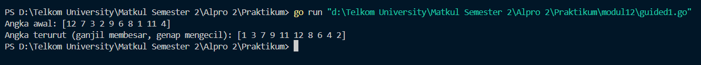
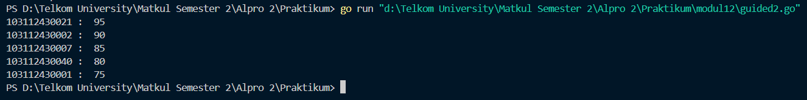
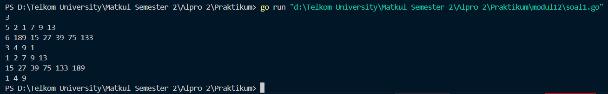
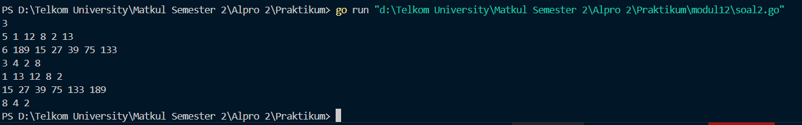
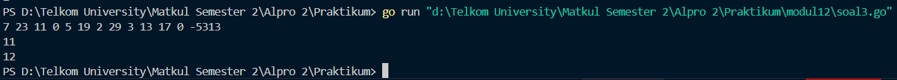
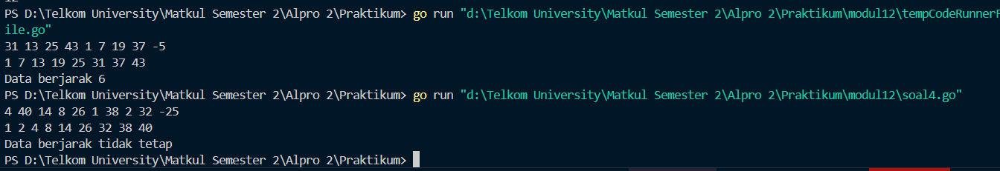
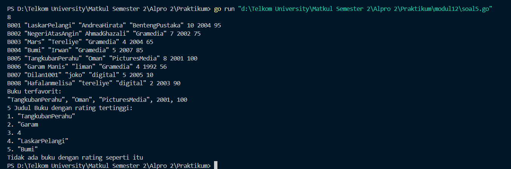

<h1 align="center">Laporan Praktikum Modul 12 & 13  
<br>PENGURUTAN DATA</h1>


<p align="center"> Faiz Az-Zahra Winanto Putra - 103112430001 </p>

## Dasar Teori 

##### Selection Sort

Pengurutan secara seleksi ini idenya adalah mencari nilai ekstrim pada sekumpulan data, kemudian meletakkan pada posisi yang seharusnya. Pada penjelasan berikut ini data akan diurut membesar (ascending), dan data dengan indeks kecil ada di "kiri" dan indeks besar ada di "kanan".
1) Cari nilai terkecil di dalam rentang data tersisa 

2) Pindahkan/tukar tempat dengan data yang berada pada posisi paling kiri pada rentang data tersisa tersebut. 

3) Ulangi proses ini sampai tersisa hanya satu data saja. Algoritma ini dikenal juga dengan nama Selection Sort, yang mana pada algoritma ini melibatkan dua proses yaitu pencarian indeks nilai ekstrim dan proses pertukaran dua nilai atau swap.

##### Insertion Sort

Pengurutan secara insertion ini idenya adalah menyisipkan suatu nilai pada posisi yang seharusnya. Berbeda dengan pengurutan seleksi, yang mana pada pengurutan ini tidak dilakukan pencarian nilai ekstrim terlebih dahulu, cukup memilih suatu nilai tertentu kemudian mencari posisinya secara sequential search. Pada penjelasan berikut ini data akan diurut mengecil (descending), dan data dengan indeks kecil ada di "kiri" dan indeks besar ada di "kanan". 

1) Untuk satu data yang belum terurut dan sejumlah data yang sudah diurutkan: Geser data yang sudah terurut tersebut (ke kanan), sehingga ada satu ruang kosong untuk memasukkan data yang belum terurut ke dalam data yang sudah terurut dan tetap menjaga keterurutan. 

2) Ulangi proses tersebut untuk setiap data yang belum terurut terhadap rangkaian data yang sudah terurut. 

Algoritma ini dikenal juga dengan nama Insertion Sort, yang mana pada algoritma ini melibatkan dua proses yaitu pencarian sekuensial dan penyisipan.


### Guided

##### Soal 1
```go
package main

import "fmt"
 

func selectionSortAscending(arr []int) {
    n := len(arr)
    for i := 0; i < n-1; i++ {
        minIndex := i
        for j := i + 1; j < n; j++ {
            if arr[j] < arr[minIndex] {
                minIndex = j
            }
        }
        arr[i], arr[minIndex] = arr[minIndex], arr[i]
    }
}

  
func selectionSortDescending(arr []int) {
    n := len(arr)
    for i := 0; i < n-1; i++ {
        maxIndex := i
        for j := i + 1; j < n; j++ {
            if arr[j] > arr[maxIndex] {
                maxIndex = j
            }
        }
        arr[i], arr[maxIndex] = arr[maxIndex], arr[i]
    }
}


func urutGanjilGenapSelection(angka []int) []int {
    ganjil := []int{}
    genap := []int{}

  
    for i := 0; i < len(angka); i++ {
        if angka[i]%2 == 0 {
            genap = append(genap, angka[i])
            } else {
                ganjil = append(ganjil, angka[i])
            }
        }

  

        selectionSortAscending(ganjil)
        selectionSortDescending(genap)
        hasil := append(ganjil, genap...)
        return hasil
    }

    func main() {
        angka := []int{12, 7, 3, 2, 9, 6, 8, 1, 11, 4}
        angkaTerurut := urutGanjilGenapSelection(angka)
        fmt.Println("Angka awal:", angka)
        fmt.Println("Angka terurut (ganjil membesar, genap mengecil):",angkaTerurut)
    }
```



#### Penjelasan
Program di atas bertujuan untuk mengurutkan sebuah array angka dengan cara yang unik, yaitu memisahkan angka ganjil dan genap terlebih dahulu, kemudian mengurutkan angka ganjil secara menaik (ascending) dan angka genap secara menurun (descending), dan akhirnya menggabungkannya kembali. Proses dimulai dengan pemisahan angka ganjil dan genap ke dalam dua array terpisah. Setelah itu, angka ganjil diurutkan menggunakan algoritma _selection sort_ secara menaik, sementara angka genap diurutkan secara menurun dengan algoritma yang sama.


##### Soal 2
```go
package main

import "fmt"

func pencarianHuruf(kalimat string, karakter string) [] int {
    var posisi [] int
  
    for i := 0; i < len(kalimat); i++ {
        if kalimat[i] == karakter[0] {
            posisi = append(posisi, i)
        }
    }
    return posisi
}

func main() {


    var kalimat, karakter string

  
    fmt.Print("Kalimat: ")
    fmt.Scan(&kalimat)

  
    fmt.Print("Karakter: ")
    fmt.Scan(&karakter)

    posisi := pencarianHuruf(kalimat, karakter)

    fmt.Println("Karakter ditemukan pada indeks: ",posisi)
}
```



#### Penjelasan
Program ini dirancang untuk mencari posisi kemunculan suatu karakter dalam sebuah kalimat yang dimasukkan oleh pengguna. Program meminta input berupa kalimat dan karakter yang ingin dicari. Fungsi `pencarianHuruf` kemudian mengiterasi setiap karakter dalam kalimat dan membandingkannya dengan karakter yang dicari. Jika ditemukan, indeks posisi karakter tersebut akan disimpan dalam sebuah slice. Fungsi ini mengembalikan slice berisi semua posisi di mana karakter ditemukan. Program kemudian menampilkan posisi-posisi tersebut kepada pengguna, memberikan informasi lengkap mengenai di mana karakter muncul dalam kalimat yang diberikan.


### Unguided

#### Soal Latihan Selection Sort

##### Soal 1
>Hercules, preman terkenal seantero ibukota, memiliki kerabat di banyak daerah. Tentunya Hercules sangat suka mengunjungi semua kerabatnya itu. 
>
>Diberikan masukan nomor rumah dari semua kerabatnya di suatu daerah, buatlah program rumahkerabat yang akan menyusun nomor-nomor rumah kerabatnya secara terurut membesar menggunakan algoritma selection sort. 
>
>Masukan dimulai dengan sebuah integer 𝒏 (0 < n < 1000), banyaknya daerah kerabat Hercules tinggal. Isi 𝒏 baris berikutnya selalu dimulai dengan sebuah integer 𝒎 (0 < m < 1000000) yang menyatakan banyaknya rumah kerabat di daerah tersebut, diikuti dengan rangkaian bilangan bulat positif, nomor rumah para kerabat. 
>
>Keluaran terdiri dari n baris, yaitu rangkaian rumah kerabatnya terurut membesar di masingmasing daerah.


```go
package main


import "fmt"


func selectionSort(arr []int) {
    var temp, i, j, idxMin int
    for i = 0; i < len(arr)-1; i++ {
        idxMin = i
        for j = i + 1; j < len(arr); j++ {
            if arr[j] < arr[idxMin] {
                idxMin = j
            }
        }
        temp = arr[idxMin]
        arr[idxMin] = arr[i]
        arr[i] = temp
    }
}

  
func main() {
    var n, m int
    fmt.Scan(&n)


    semuaDaerah := make([][]int, n)


    for i := 0; i < n; i++ {
        fmt.Scan(&m)
        rumah := make([]int, m)

  
        for j := 0; j < m; j++ {
            fmt.Scan(&rumah[j])
        }
  
        selectionSort(rumah)
        semuaDaerah[i] = rumah
    }

  
    for i := 0; i < len(semuaDaerah); i++ {
        for j := 0; j < len(semuaDaerah[i]); j++ {
            fmt.Print(semuaDaerah[i][j], " ")
        }
        fmt.Println()
    }
}
```




Program di atas adalah implementasi yang menggunakan algoritma _selection sort_ untuk mengurutkan data dari beberapa daerah yang terdiri dari beberapa rumah. Setiap rumah memiliki beberapa angka (mungkin representasi dari ukuran rumah atau data lain), dan kita ingin mengurutkan data rumah tersebut secara terpisah untuk setiap daerah


##### Soal 2
>Belakangan diketahui ternyata Hercules itu tidak berani menyeberang jalan, maka selalu diusahakan agar hanya menyeberang jalan sesedikit mungkin, hanya diujung jalan. Karena nomor rumah sisi kiri jalan selalu ganjil dan sisi kanan jalan selalu genap, maka buatlah program kerabat dekat yang akan menampilkan nomor rumah mulai dari nomor yang ganjil lebih dulu terurut membesar dan kemudian menampilkan nomor rumah dengan nomor genap terurut mengecil. 
>
>Format Masukan masih persis sama seperti sebelumnya. 
>
>Keluaran terdiri dari n baris, yaitu rangkaian rumah kerabatnya terurut membesar untuk nomor ganjil, diikuti dengan terurut mengecil untuk nomor genap, di masing-masing daerah.

Keterangan: Terdapat 3 daerah dalam contoh masukan. Baris kedua berisi campuran bilangan ganjil dan genap. 

Baris berikutnya hanya berisi bilangan ganjil, dan baris terakhir hanya berisi bilangan genap. Petunjuk: • Waktu pembacaan data, bilangan ganjil dan genap dipisahkan ke dalam dua array yang berbeda, untuk kemudian masing-masing diurutkan tersendiri. • Atau, tetap disimpan dalam satu array, diurutkan secara keseluruhan. Tetapi pada waktu pencetakan, mulai dengan mencetak semua nilai ganjil lebih dulu, kemudian setelah selesai cetaklah semua nilai genapnya


```go
package main

import "fmt"


func selectionSortAsc(arr []int) {
    var i, j, minIdx, temp int
    for i = 0; i < len(arr)-1; i++ {
        minIdx = i
        for j = i + 1; j < len(arr); j++ {
            if arr[j] < arr[minIdx] {
                minIdx = j
            }
        }
        temp = arr[i]
        arr[i] = arr[minIdx]
        arr[minIdx] = temp
    }
}


func selectionSortDesc(arr []int) {
    var i, j, maxIdx, temp int
    for i = 0; i < len(arr)-1; i++ {
        maxIdx = i
        for j = i + 1; j < len(arr); j++ {
            if arr[j] > arr[maxIdx] {
                maxIdx = j
            }
        }
        temp = arr[i]
        arr[i] = arr[maxIdx]
        arr[maxIdx] = temp
    }
}
 

func prosesDaerah(m int) []int {
    var i int
    var rumah []int = make([]int, m)
    var ganjil, genap []int

    for i = 0; i < m; i++ {
        fmt.Scan(&rumah[i])
    }

    for i = 0; i < m; i++ {
        if rumah[i]%2 == 1 {
            ganjil = append(ganjil, rumah[i])
        } else {
            genap = append(genap, rumah[i])
        }
    }
    selectionSortAsc(ganjil)
    selectionSortDesc(genap)

    var hasil []int = append(ganjil, genap...)
    return hasil
}


func cetakHasil(hasil [][]int) {
    var i, j int
    for i = 0; i < len(hasil); i++ {
        for j = 0; j < len(hasil[i]); j++ {
            fmt.Print(hasil[i][j], " ")
        }
        fmt.Println()
    }
}


func main() {
    var n, i, m int
    var hasil [][]int

    fmt.Scan(&n)

    for i = 0; i < n; i++ {
        fmt.Scan(&m)
        hasil = append(hasil, prosesDaerah(m))
    }
    cetakHasil(hasil)
}
```



Program di atas berfungsi untuk mengurutkan data rumah di beberapa daerah berdasarkan kategori ganjil dan genap dengan menggunakan algoritma _selection sort_. Program dimulai dengan membaca jumlah daerah dan jumlah rumah di setiap daerah, kemudian untuk setiap daerah, data rumah tersebut diproses dengan memisahkan angka ganjil dan genap. Angka-angka ganjil diurutkan secara menaik (ascending), sedangkan angka-angka genap diurutkan secara menurun (descending). Setelah itu, hasil pengurutan untuk setiap daerah digabungkan, dengan angka ganjil yang terurut lebih dulu diikuti oleh angka genap yang terurut. Setiap daerah memiliki hasil pengurutan yang dicetak pada baris yang terpisah. Algoritma _selection sort_ digunakan untuk mengurutkan angka-angka di dalam kategori ganjil dan genap. Sebagai contoh, jika inputnya adalah angka rumah dari dua daerah, hasilnya adalah daftar rumah untuk setiap daerah dengan angka ganjil yang terurut menaik dan angka genap yang terurut menurun. Program ini memungkinkan pengurutan yang terstruktur dan hasil yang jelas berdasarkan kriteria tertentu untuk setiap daerah.

##### Soal 3
>Kompetisi pemrograman yang baru saja berlalu diikuti oleh 17 tim dari berbagai perguruan tinggi ternama. Dalam kompetisi tersebut, setiap tim berlomba untuk menyelesaikan sebanyak mungkin problem yang diberikan. Dari 13 problem yang diberikan, ada satu problem yang menarik. Problem tersebut mudah dipahami, hampir semua tim mencoba untuk menyelesaikannya, tetapi hanya 3 tim yang berhasil. Apa sih problemnya? 
>
>"Median adalah nilai tengah dari suatu koleksi data yang sudah terurut. Jika jumlah data genap, maka nilai median adalah rerata dari kedua nilai tengahnya. Pada problem ini, semua data merupakan bilangan bulat positif, dan karenanya rerata nilai tengah dibulatkan ke bawah."
>
>Buatlah program median yang mencetak nilai median terhadap seluruh data yang sudah terbaca, jika data yang dibaca saat itu adalah 0. 
>
>Masukan berbentuk rangkaian bilangan bulat. Masukan tidak akan berisi lebih dari 1000000 data, tidak termasuk bilangan 0. Data 0 merupakan tanda bahwa median harus dicetak, tidak termasuk data yang dicari mediannya. Data masukan diakhiri dengan bilangan bulat -5313. K
>
>Keluaran adalah median yang diminta, satu data per baris.
>
>Keterangan: Sampai bilangan 0 yang pertama, data terbaca adalah 7 23 11, setelah tersusun: 7 11 23, maka median saat itu adalah 11. Sampai bilangan 0 yang kedua, data adalah 7 23 11 5 19 2 29 3 13 17, setelah tersusun diperoleh: 2 3 5 7 11 13 17 19 23 29. Karena ada 10 data, genap, maka median adalah (11+13)/2=12. 
>
>Petunjuk: Untuk setiap data bukan 0 (dan bukan marker -5313541) simpan ke dalam array, Dan setiap kali menemukan bilangan 0, urutkanlah data yang sudah tersimpan dengan menggunakan metode insertion sort dan ambil mediannya.


```go
package main

import "fmt"
  

func selectionSort(arr []int) {
    var i, j, minIdx, temp int
    for i = 0; i < len(arr)-1; i++ {
        minIdx = i
        for j = i + 1; j < len(arr); j++ {
            if arr[j] < arr[minIdx] {
                minIdx = j
            }
        }
        temp = arr[i]
        arr[i] = arr[minIdx]
        arr[minIdx] = temp
    }
}


func hitungMedian(data []int) int {
    var n, tengah, median int
    n = len(data)

    selectionSort(data)
  
    if n%2 == 1 {
        tengah = n / 2
        median = data[tengah]
    } else {
        tengah = n / 2
        median = (data[tengah-1] + data[tengah]) / 2
    }
    return median
}

  
func main() {
    var input int
    var data []int
    var salinan []int
    var hasil int
  
    for {
        fmt.Scan(&input)
        if input == -5313 {
            break
        } else if input == 0 {
            if len(data) > 0 {
                salinan = make([]int, len(data))
                copy(salinan, data)
                hasil = hitungMedian(salinan)
                fmt.Println(hasil)
            }
        } else {
            data = append(data, input)
        }
    }
}
```



Program diatas digunakan untuk menghitung nilai **median** dari kumpulan bilangan bulat positif yang dibaca secara bertahap dari input. Median dihitung setiap kali ditemukan angka **0** dalam input, dan data dihentikan dengan tanda akhir berupa -5313. Program ini terdiri dari dua prosedur yaitu selectionSort dan main, serta satu fungsi yaitu hitungMedian. Alur program dimulai dari fungsi main, di mana setiap bilangan yang dibaca akan disimpan dalam array data. Jika bilangan tersebut adalah 0, maka program akan membuat salinan dari data yang sudah masuk lalu memanggil fungsi hitungMedian untuk menghitung median-nya. Fungsi hitungMedian menggunakan prosedur selectionSort untuk mengurutkan data terlebih dahulu, kemudian menghitung median sesuai dengan panjang data jika ganjil, median adalah elemen tengah; jika genap, median adalah rata-rata dari dua elemen tengah (dibulatkan ke bawah karena integer). Setelah median ditemukan, hasilnya dicetak ke layar. Proses terus berulang sampai ditemukan bilangan -5313 yang menandakan akhir dari input.


#### Soal Latihan Insertion Sort

##### Soal 1
>Buatlah sebuah program yang digunakan untuk membaca data integer seperti contoh yang diberikan di bawah ini, kemudian diurutkan (menggunakan metoda insertion sort), dan memeriksa apakah data yang terurut berjarak sama terhadap data sebelumnya. 
>
>Masukan terdiri dari sekumpulan bilangan bulat yang diakhiri oleh bilangan negatif. Hanya bilangan non negatif saja yang disimpan ke dalam array. 
>
>Keluaran terdiri dari dua baris. Baris pertama adalah isi dari array setelah dilakukan pengurutan, sedangkan baris kedua adalah status jarak setiap bilangan yang ada di dalam array. "Data berjarak x" atau "data berjarak tidak tetap".


```go
package main

import "fmt"
  
func insertionSort(arr []int) []int {
    for i := 1; i < len(arr); i++ {
        temp := arr[i]
        j := i
        for j > 0 && temp < arr[j-1] {
            arr[j] = arr[j-1]
            j = j - 1
        }
        arr[j] = temp
    }
    return arr
}

  
func jarakTetap(arr []int) (bool, int) {
    if len(arr) < 2 {
        return true, 0
    }
    selisih := arr[1] - arr[0]
    for i := 2; i < len(arr); i++ {
        if arr[i]-arr[i-1] != selisih {
            return false, 0
        }
    }
    return true, selisih
}

  
func main() {
    data := []int{}
    var x int
  
    for {
        fmt.Scan(&x)
        if x < 0 {
            break
        }
        data = append(data, x)
    }

    data = insertionSort(data)  

    for i := 0; i < len(data); i++ {
        fmt.Print(data[i])
        if i != len(data)-1 {
            fmt.Print(" ")
        }
    }
    fmt.Println()

    tetap, jarak := jarakTetap(data)
    
    if tetap {
        fmt.Println("Data berjarak", jarak)
    } else {
        fmt.Println("Data berjarak tidak tetap")
    }
}
```




Program di atas melakukan dua tugas utama: pertama, mengurutkan serangkaian angka yang dimasukkan pengguna menggunakan algoritma _insertion sort_, dan kedua, memeriksa apakah angka-angka yang telah diurutkan membentuk deret aritmatika, yaitu memiliki selisih yang tetap antar elemen. Pengguna diminta untuk memasukkan angka satu per satu, yang kemudian disimpan dalam sebuah array. Program akan berhenti menerima input saat pengguna memasukkan angka negatif. Setelah itu, array tersebut diurutkan menggunakan _insertion sort_ yang mengurutkan angka secara bertahap dengan membandingkan dan memindahkan elemen-elemen yang lebih besar ke posisi yang lebih tepat. Setelah data terurut, program memeriksa apakah selisih antara elemen-elemen berturut-turut tetap sama, yang merupakan ciri khas dari deret aritmatika. Jika selisih antar elemen tetap, program akan mencetak jarak tersebut; jika tidak, program akan menyatakan bahwa data tersebut tidak memiliki jarak yang tetap. Sebagai contoh, jika inputnya adalah angka `5, 1, 9, 3`, maka program akan mengurutkannya menjadi `1, 3, 5, 9`, dan kemudian memeriksa apakah data tersebut membentuk deret aritmatika. Dalam hal ini, karena selisih antara elemen-elemen tidak sama, program akan mencetak bahwa data berjarak tidak tetap. Program ini sangat berguna untuk mengurutkan data dan menganalisis sifat tertentu dari data yang telah diurutkan.


##### Soal 2
>Sebuah program perpustakaan digunakan untuk mengelola data buku di dalam suatu perpustakaan. Misalnya terdefinisi struct dan array seperti berikut ini

```
const nMax : integer = 7919 
type Buku = < 
	id, judul, penulis, penerbit : string 
	eksemplar, tahun, rating : integer > 
type DaftarBuku = array [ 1..nMax] of Buku 
Pustaka : DaftarBuku 
nPustaka: integer
```

Masukan terdiri dari beberapa baris. Baris pertama adalah bilangan bulat N yang menyatakan banyaknya data buku yang ada di dalam perpustakaan. N baris berikutnya, masing-masingnya adalah data buku sesuai dengan atribut atau field pada struct. Baris terakhir adalah bilangan bulat yang menyatakan rating buku yang akan dicari.

Keluaran terdiri dari beberapa baris. Baris pertama adalah data buku terfavorit, baris kedua adalah lima judul buku dengan rating tertinggi, selanjutnya baris terakhir adalah data buku yang dicari sesuai rating yang diberikan pada masukan baris terakhir.

Lengkapi subprogram-subprogram dibawah ini, sesuai dengan I.S. dan F.S yang diberikan.

```
procedure DaftarkanBuku(in/out pustaka : DaftarBuku, n : integer) 
{I.S. sejumlah n data buku telah siap para piranti masukan 
F.S. n berisi sebuah nilai, dan pustaka berisi sejumlah n data buku} 

procedure CetakTerfavorit(in pustaka : DaftarBuku, in n : integer) 
{I.S. array pustaka berisi n buah data buku dan belum terurut 
F.S. Tampilan data buku (judul, penulis, penerbit, tahun) 
terfavorit, yaitu memiliki rating tertinggi} 

procedure UrutBuku( in/out pustaka : DaftarBuku, n : integer ) 
{I.S. Array pustaka berisi n data buku 
F.S. Array pustaka terurut menurun/mengecil terhadap rating. 
Catatan: Gunakan metoda Insertion sort} 

procedure Cetak5Terbaru( in pustaka : DaftarBuku, n integer ) 
{I.S. pustaka berisi n data buku yang sudah terurut menurut rating 
F.S. Laporan 5 judul buku dengan rating tertinggi 
Catatan: Isi pustaka mungkin saja kurang dari 5} 

procedure CariBuku(in pustaka : DaftarBuku, n : integer, r : integer ) 
{I.S. pustaka berisi n data buku yang sudah terurut menurut rating 
F.S. Laporan salah satu buku (judul, penulis, penerbit, tahun, eksemplar, rating) dengan rating yang diberikan. Jika tidak ada buku dengan rating yang ditanyakan, cukup tuliskan “Tidak ada buku dengan rating seperti itu”. 
Catatan: Gunakan pencarian biner/belah dua.}
```

```go
package main

import "fmt"


const nMax = 7919

type Buku struct {
    id, judul, penulis, penerbit string
    eksemplar, tahun, rating     int
}

type DaftarBuku [nMax]Buku

  
func DaftarkanBuku(pustaka *DaftarBuku, n *int) {
    var buku Buku
    var i int
    fmt.Scan(&(*n))
    for i = 0; i < *n; i++ {
        fmt.Scan(&buku.id, &buku.judul, &buku.penulis, &buku.penerbit, &buku.eksemplar, &buku.tahun, &buku.rating)
        (*pustaka)[i] = buku
    }
}

  
func CetakTerfavorit(pustaka DaftarBuku, n int) {
    var terfavorit Buku
    var i int
    
    terfavorit = pustaka[0]

    for i = 1; i < n; i++ {
        if pustaka[i].rating > terfavorit.rating {
            terfavorit = pustaka[i]
        }
    }

    fmt.Println("Buku terfavorit:")
    fmt.Printf("%s, %s, %s, %d, %d\n", terfavorit.judul, terfavorit.penulis, terfavorit.penerbit, terfavorit.tahun, terfavorit.rating)
}

  
func UrutBuku(pustaka *DaftarBuku, n int) {
    var i, j int
    var temp Buku

    for i = 1; i < n; i++ {
        temp = (*pustaka)[i]
        j = i - 1
        for j >= 0 && (*pustaka)[j].rating < temp.rating {
            (*pustaka)[j+1] = (*pustaka)[j]
            j--
        }
        (*pustaka)[j+1] = temp
    }
}

  
func Cetak5Terbaru(pustaka DaftarBuku, n int) {
    var i int
    
    if n > 5 {
        n = 5
    }
 
    fmt.Println("5 Judul Buku dengan rating tertinggi:")

    for i = 0; i < n; i++ {
        fmt.Printf("%d. %s\n", i+1, pustaka[i].judul)
    }
}

  
func CariBuku(pustaka DaftarBuku, n int, r int) {
    var kiri, kanan, tengah int
    var ditemukan bool

    kiri = 0
    kanan = n - 1
    ditemukan = false

    for kiri <= kanan {
        tengah = (kiri + kanan) / 2
        if pustaka[tengah].rating == r {
            fmt.Printf("Buku dengan rating %d ditemukan:\n", r)
            fmt.Printf("%s, %s, %s, %d, %d, %d\n", pustaka[tengah].judul, pustaka[tengah].penulis, pustaka[tengah].penerbit, pustaka[tengah].tahun, pustaka[tengah].eksemplar, pustaka[tengah].rating)
            ditemukan = true
            break
        } else if pustaka[tengah].rating < r {
            kanan = tengah - 1
        } else {
            kiri = tengah + 1
        }
    }

    if !ditemukan {
        fmt.Println("Tidak ada buku dengan rating seperti itu")
    }
}

  
func main() {
    var pustaka DaftarBuku
    var nPustaka, ratingCari int
  
    DaftarkanBuku(&pustaka, &nPustaka)
    fmt.Scan(&ratingCari)
    UrutBuku(&pustaka, nPustaka)
    CetakTerfavorit(pustaka, nPustaka)
    Cetak5Terbaru(pustaka, nPustaka)
    CariBuku(pustaka, nPustaka, ratingCari)
}
```



Program di atas dirancang untuk mengelola data buku di sebuah pustaka, dengan memungkinkan pengguna untuk mendaftarkan buku, mengurutkannya berdasarkan rating, mencari buku berdasarkan rating, serta menampilkan buku-buku dengan rating tertinggi. Setiap buku memiliki informasi seperti ID, judul, penulis, penerbit, jumlah eksemplar, tahun terbit, dan rating. Program ini pertama-tama meminta pengguna untuk memasukkan jumlah buku yang ingin didaftarkan beserta detail masing-masing buku. Setelah data buku dimasukkan, program mengurutkan buku berdasarkan rating menggunakan algoritma _insertion sort_, di mana buku dengan rating tertinggi akan muncul terlebih dahulu. Selanjutnya, program akan menampilkan buku terfavorit, yakni buku dengan rating tertinggi, dan juga mencetak lima buku dengan rating tertinggi, jika jumlah buku lebih dari lima. Program juga memungkinkan pengguna untuk mencari buku berdasarkan rating tertentu menggunakan pencarian biner, yang akan mencari buku dengan rating yang tepat dan menampilkan detailnya jika ditemukan. Jika tidak ditemukan, program akan memberi tahu pengguna bahwa tidak ada buku dengan rating yang dicari. Program ini menggabungkan pengurutan, pencarian, dan tampilan informasi buku secara efisien, memberikan kemudahan dalam mengelola koleksi buku di pustaka.

    


