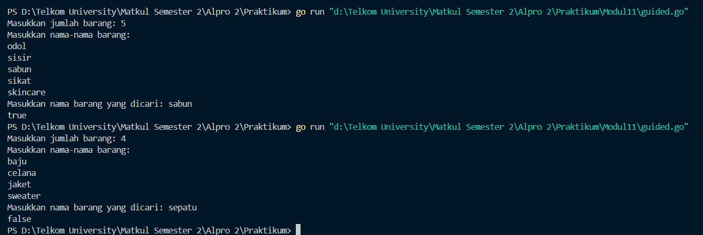
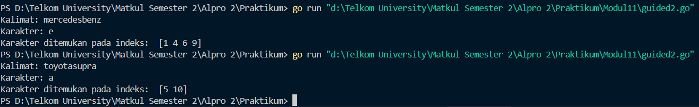
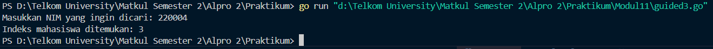
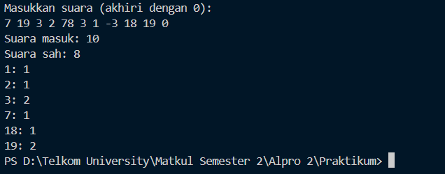
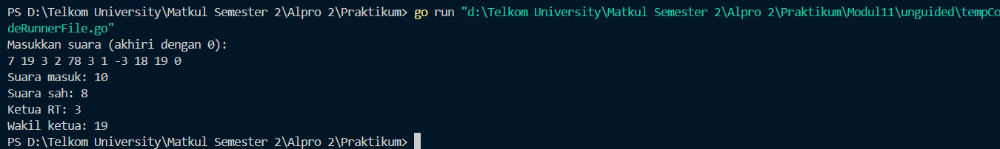
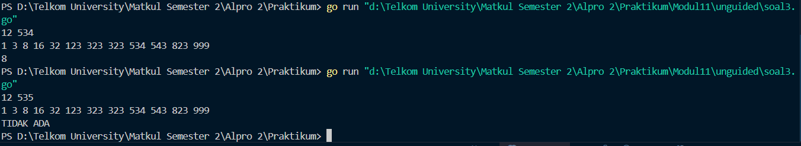

<h1 align="center">Laporan Praktikum Modul 11  
<br>PENCARIAN NILAI ACAK PADA HIMPUNAN DATA</h1>


<p align="center"> Faiz Az-Zahra Winanto Putra - 103112430001 </p>

### Dasar Teori 

Pencarian secara sekuensial ini adalah pencarian yang dilakukan dari data pertama, kedua hingga terakhir secara satu persatu dan berurutan. Ciri khas dari pencarian ini adalah proses pencarian akan berhenti ketika data yang dicari ditemukan, walaupun masih terdapat data yang belum dicek nilainya. Algoritma ini dikenal dengan nama Sequential Search, karena prosesnya melakukan pengecekan setiap elemen array secara satu persatu dan sekuensial dari data pertama hingga ditemukan atau data terakhir.


### Guided

##### Soal 1
```go
package main
  
import "fmt"


func cariBarang(daftar []string, x string) bool {
 
	for _, barang := range daftar {
        if barang == x {
            return true
        }
    }
    return false
}

  

func main() {

    var n int
    fmt.Print("Masukkan jumlah barang: ")
    fmt.Scan(&n)

    daftarBarang := make([]string, n)
    fmt.Println("Masukkan nama-nama barang:")

    for i := 0; i < n; i++ {
        fmt.Scan(&daftarBarang[i])
    }

  
    var barangDicari string

    fmt.Print("Masukkan nama barang yang dicari: ")
    fmt.Scan(&barangDicari)

    ditemukan := cariBarang(daftarBarang, barangDicari)
    fmt.Println(ditemukan)
}
```



#### Penjelasan
Program ini mencari apakah suatu barang ada dalam daftar yang dimasukkan pengguna. Setelah meminta jumlah barang dan nama-nama barang, program meminta nama barang yang ingin dicari. Fungsi `cariBarang` memeriksa apakah barang tersebut ada dalam daftar dan mengembalikan `true` jika ditemukan, atau `false` jika tidak. Program kemudian mencetak hasil pencarian, memberikan informasi apakah barang ada dalam daftar atau tidak.


##### Soal 2
```go
package main

import "fmt"

func pencarianHuruf(kalimat string, karakter string) [] int {
    var posisi [] int
  
    for i := 0; i < len(kalimat); i++ {
        if kalimat[i] == karakter[0] {
            posisi = append(posisi, i)
        }
    }
    return posisi
}

func main() {


    var kalimat, karakter string

  
    fmt.Print("Kalimat: ")
    fmt.Scan(&kalimat)

  
    fmt.Print("Karakter: ")
    fmt.Scan(&karakter)

    posisi := pencarianHuruf(kalimat, karakter)

    fmt.Println("Karakter ditemukan pada indeks: ",posisi)
}
```



#### Penjelasan
Program ini dirancang untuk mencari posisi kemunculan suatu karakter dalam sebuah kalimat yang dimasukkan oleh pengguna. Program meminta input berupa kalimat dan karakter yang ingin dicari. Fungsi `pencarianHuruf` kemudian mengiterasi setiap karakter dalam kalimat dan membandingkannya dengan karakter yang dicari. Jika ditemukan, indeks posisi karakter tersebut akan disimpan dalam sebuah slice. Fungsi ini mengembalikan slice berisi semua posisi di mana karakter ditemukan. Program kemudian menampilkan posisi-posisi tersebut kepada pengguna, memberikan informasi lengkap mengenai di mana karakter muncul dalam kalimat yang diberikan.

##### Soal 3
```go
package main

import (
    "fmt"
)

  
type Mahasiswa struct {
    nama string
    nim  string
}

func binarySearch(mahasiswa []Mahasiswa, x string) int {
    low := 0
    high := len(mahasiswa) - 1

    for low <= high {
        mid := (low + high) / 2
        if mahasiswa[mid].nim == x {
            return mid
        } else if mahasiswa[mid].nim < x {
            low = mid + 1
        } else {
            high = mid - 1
        }
    }
    return -1
}

  
func main() {
    mahasiswa := []Mahasiswa{
    
        {nama: "Andi", nim: "220001"},
        {nama: "Budi", nim: "220002"},
        {nama: "Citra", nim: "220003"},
        {nama: "Dina", nim: "220004"},
    }

    var x string

    fmt.Print("Masukkan NIM yang ingin dicari: ")
    fmt.Scanln(&x)

    index := binarySearch(mahasiswa, x)

    if index != -1 {
        fmt.Printf("Indeks mahasiswa ditemukan: %d\n", index)
    } else {
        fmt.Println("NIM tidak ditemukan.")
    }
}
```


#### Penjelasan
Program ini mencari mahasiswa berdasarkan NIM menggunakan algoritma pencarian biner. Data mahasiswa disimpan dalam slice, dan pengguna diminta memasukkan NIM yang ingin dicari. Fungsi `binarySearch` membandingkan NIM yang dicari dengan NIM pada posisi tengah dan melanjutkan pencarian ke bagian kiri atau kanan. Jika NIM ditemukan, program menampilkan indeks mahasiswa, dan jika tidak, menampilkan pesan "NIM tidak ditemukan." Program ini efisien karena menggunakan pencarian biner pada data yang sudah terurut.
### Unguided

#### Soal Latihan Modul 10

##### Soal 1
>Pada pemilihan ketua RT yang baru saja berlangsung, terdapat 20 calon ketua yang bertanding memperebutkan suara warga. Perhitungan suara dapat segera dilakukan karena warga cukup mengisi formulir dengan nomor dari calon ketua RT yang dipilihnya. Seperti biasa, selalu ada pengisian yang tidak tepat atau dengan nomor pilihan di luar yang tersedia, sehingga data juga harus divalidasi. Tugas Anda untuk membuat program mencari siapa yang memenangkan pemilihan ketua RT. 
>
>Buatlah program pilkart yang akan membaca, memvalidasi, dan menghitung suara yang diberikan dalam pemilihan ketua RT tersebut. 
>
>Masukan hanya satu baris data saja, berisi bilangan bulat valid yang kadang tersisipi dengan data tidak valid. Data valid adalah integer dengan nilai di antara 1 s.d. 20 (inklusif). Data berakhir jika ditemukan sebuah bilangan dengan nilai 0. 
>
>Keluaran dimulai dengan baris berisi jumlah data suara yang terbaca, diikuti baris yang berisi berapa banyak suara yang valid. Kemudian sejumlah baris yang mencetak data para calon apa saja yang mendapatkan suara.


```go
package main

import "fmt"
  

func main() {
    const maxCalon = 20
    var suara int
    var totalMasuk, totalSah int
    var perolehan [maxCalon + 1]int
    var input [100]int


    fmt.Println("Masukkan suara (akhiri dengan 0):")

  
    i := 0

    for {
        fmt.Scan(&suara)
        if suara == 0 {
            break
        }
        input[i] = suara
        i++
    }

  

    totalMasuk = i

  
    j := 0
    for j < totalMasuk {
        s := input[j]
        if s >= 1 && s <= maxCalon {
            perolehan[s]++
            totalSah++
        }
        j++
    }

  
    fmt.Printf("Suara masuk: %d\n", totalMasuk)
    fmt.Printf("Suara sah: %d\n", totalSah)


    k := 1

    for k <= maxCalon {
        if perolehan[k] > 0 {
            fmt.Printf("%d: %d\n", k, perolehan[k])
        }
        k++
    }
}
```




Program Golang ini dirancang untuk menghitung dan menampilkan hasil perolehan suara dalam sebuah pemilu atau pemilihan. Program dimulai dengan mendeklarasikan variabel untuk menyimpan jumlah calon, suara yang dimasukkan, serta array untuk menyimpan suara yang valid dan perolehan suara untuk masing-masing calon. Pengguna diminta untuk memasukkan suara satu per satu, dan proses input akan berhenti ketika angka 0 dimasukkan. Setiap suara yang valid, yaitu angka antara 1 dan jumlah maksimal calon, akan dihitung dan ditambahkan pada array `perolehan` untuk calon yang bersangkutan, serta menghitung jumlah suara sah. Setelah proses input selesai, program akan menampilkan total suara yang masuk, jumlah suara yang sah, dan perolehan suara untuk setiap calon yang mendapatkan suara lebih dari 0. Program ini memungkinkan untuk memproses hasil pemilu dengan efisien, memastikan hanya suara yang valid yang dihitung, dan memberikan laporan yang jelas tentang hasil pemilihan.


##### Soal 2
>Berdasarkan program sebelumnya, buat program pilkart yang mencari siapa pemenang pemilihan ketua RT. Sekaligus juga ditentukan bahwa wakil ketua RT adalah calon yang mendapatkan suara terbanyak kedua. Jika beberapa calon mendapatkan suara terbanyak yang Halaman sama, ketua terpilih adalah dengan nomor peserta yang paling kecil dan wakilnya dengan nomor peserta terkecil berikutnya. 
>
>Masukan hanya satu baris data saja, berisi bilangan bulat valid yang kadang tersisipi dengan data tidak valid. Data valid adalah bilangan bulat dengan nilai di antara 1 s.d. 20 (inklusif). Data berakhir jika ditemukan sebuah bilangan dengan nilai 0. 
>
>Keluaran dimulai dengan baris berisi jumlah data suara yang terbaca, diikuti baris yang berisi berapa banyak suara yang valid. Kemudian tercetak calon nomor berapa saja yang menjadi pasangan ketua RT dan wakil ketua RT yang baru


```go
package main

import "fmt"

const maxCalon = 20

func inputSuara() ([]int, int) {
    var suara int
    var input []int
  

    fmt.Println("Masukkan suara (akhiri dengan 0):")

    for {
        fmt.Scan(&suara)
        if suara == 0 {
            break
        }
        input = append(input, suara)
    }
    return input, len(input)
}

  

func hitungSuara(input []int, totalMasuk int, perolehan []int) int {
    var totalSah int
    for j := 0; j < totalMasuk; j++ {
        s := input[j]
        if s >= 1 && s <= maxCalon {
            perolehan[s]++
            totalSah++
        }
    }
    return totalSah
}

  

func tampilkanHasil(totalMasuk int, totalSah int) {
    fmt.Printf("Suara masuk: %d\n", totalMasuk)
    fmt.Printf("Suara sah: %d\n", totalSah)
}

  

func cariKetuaWakil(perolehan []int) (int, int) {

    var ketua, wakil int
    var max1, max2 int

    for i := 1; i <= maxCalon; i++ {
        suara := perolehan[i]
        if suara > max1 {
            max2 = max1
            wakil = ketua
            max1 = suara
            ketua = i
        } else if suara == max1 && i < ketua {
            max2 = max1
            wakil = ketua
            ketua = i
        } else if suara > max2 {
            max2 = suara
            wakil = i
        } else if suara == max2 && i < wakil && i != ketua {
            wakil = i
        }
    }
    return ketua, wakil
}

  
func main() {

    perolehan := make([]int, maxCalon+1)


    input, totalMasuk := inputSuara()
    totalSah := hitungSuara(input, totalMasuk, perolehan)
    tampilkanHasil(totalMasuk, totalSah)
    ketua, wakil := cariKetuaWakil(perolehan)

    if totalSah > 0 {
        fmt.Printf("Ketua RT: %d\n", ketua)
        if wakil > 0 {
            fmt.Printf("Wakil ketua: %d\n", wakil)
        }
    }
}
```



Program Golang ini menghitung hasil suara pemilihan dan menentukan ketua serta wakil ketua berdasarkan perolehan suara. Fungsi `inputSuara` digunakan untuk mengumpulkan suara dari pengguna, sementara `hitungSuara` menghitung suara sah dan memperbarui perolehan suara setiap calon. Fungsi `tampilkanHasil` menampilkan jumlah suara masuk dan sah. Fungsi `cariKetuaWakil` menentukan calon dengan suara terbanyak sebagai ketua dan suara terbanyak kedua sebagai wakil ketua. Fungsi `main` mengatur alur program, mengelola input, perhitungan, dan menampilkan hasil pemilihan. Program ini efektif untuk menghitung hasil pemilihan dalam skala kecil.


##### Soal 3
>Diberikan n data integer positif dalam keadaan terurut membesar dan sebuah integer lain k, apakah bilangan k tersebut ada dalam daftar bilangan yang diberikan? Jika ya, berikan indeksnya, jika tidak sebutkan "TIDAK ADA". 
>
>Masukan terdiri dari dua baris. Baris pertama berisi dua buah integer positif, yaitu n dan k. n menyatakan banyaknya data, dimana 1 < n <= 1000000. k adalah bilangan yang ingin dicari. Baris kedua berisi n buah data integer positif yang sudah terurut membesar. 
>
>Keluaran terdiri dari satu baris saja, yaitu sebuah bilangan yang menyatakan posisi data yang dicari (k) dalam kumpulan data yang diberikan. Posisi data dihitung dimulai dari angka 0. Atau memberikan keluaran "TIDAK ADA" jika data k tersebut tidak ditemukan dalam kumpulan. 

Program yang dibangun harus menggunakan subprogram dengan mengikuti kerangka yang sudah diberikan berikut ini.

```
package main 
import "fmt" 

const NMAX = 1000000 
var data [NMAX]int 

func main(){ /* buatlah kode utama yang membaca baris pertama (n dan k). kemudian data diisi oleh prosedur isiArray(n), dan pencarian oleh fungsi posisi(n,k), dan setelah itu output dicetak. */ }

func isiArray(n int){ 

/* I.S. terdefinisi integer n, dan sejumlah n data sudah siap pada piranti masukan. F.S. Array data berisi n (<=NMAX) bilangan */ } 

func posisi(n, k int) int { /* mengembalikan posisi k dalam array data dengan n elemen. Posisi dimulai dari posisi 0. Jika tidak ada kembalikan -1 */ }
```

```go
package main

import "fmt"

  
const NMAX = 1000000
  
var data [NMAX]int

func isiArray(n int) {
    for i := 0; i < n; i++ {
        fmt.Scan(&data[i])
    }
}

  
func posisi(n, k int) int {
    low := 0
    high := n - 1

    for low <= high {
        mid := (low + high) / 2
        if data[mid] == k {
            return mid
        } else if data[mid] < k {
            low = mid + 1
        } else {
            high = mid - 1
        }
    }
    return -1
}

  
func main() {

    var n, k int

    fmt.Scan(&n, &k)
    isiArray(n)

    pos := posisi(n, k)

  
    if pos == -1 {
        fmt.Println("TIDAK ADA")
    } else {
        fmt.Println(pos)
    }
}
```



Program ini menggunakan algoritma pencarian biner untuk mencari posisi elemen dalam sebuah array yang sudah terurut. Program dimulai dengan meminta input dari pengguna, yaitu jumlah elemen array dan nilai yang ingin dicari. Array kemudian diisi dengan elemen-elemen yang dimasukkan pengguna. Fungsi `posisi` melakukan pencarian biner, dimana batas bawah dan atas array ditentukan, lalu posisi tengah dihitung dan dibandingkan dengan elemen yang dicari. Jika elemen ditemukan, posisi tersebut dikembalikan; jika tidak, fungsi mengembalikan nilai `-1`. Fungsi utama menampilkan posisi elemen jika ditemukan, atau pesan "TIDAK ADA" jika elemen tidak ada dalam array. Program ini efektif digunakan untuk mencari elemen dalam array yang terurut dengan waktu pencarian yang lebih efisien dibandingkan pencarian linear.


    


