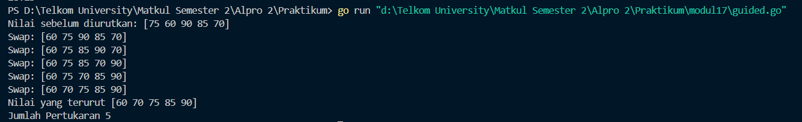
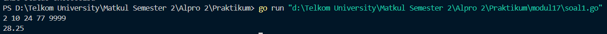
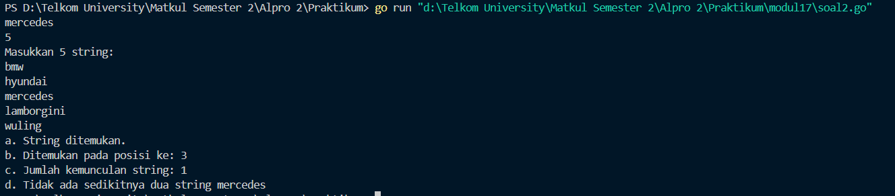
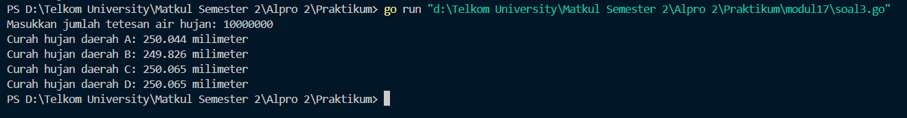
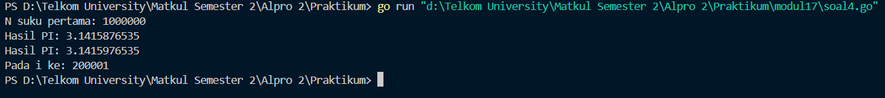
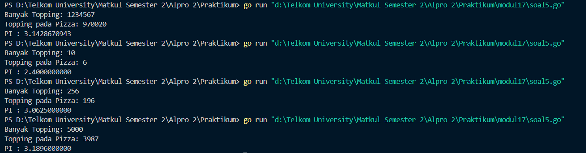

<h1 align="center">Laporan Praktikum Modul 17 
<br>SKEMA PEMROSESAN SEKUENSIAL</h1>


<p align="center"> Faiz Az-Zahra Winanto Putra - 103112430001 </p>

## Dasar Teori 

Pemrosesan sekuensial merupakan pemrosesan terurut satu pesatu (baris per baris), dari sekumpulan informasi yang sejenis dimana setiap elemennya dapat diakses dengan keterurutan tertentu.

Dengan dipersenjatai bentuk perulangan dan bentuk percabangan, banyak problem komputasi yang dapat diselesaikan. Berikut ini beberapa skema (pola) yang umum ditemukan untuk pemrosesan data (secara sekuensial).


### Guided

#### Soal Guided No 1

```go
package main 

import (
    "fmt"
)

  
func bubbleSort(arr []int) int {
    swaps := 0
    n := len(arr)
    for i := 0; i < n-1; i++ {
        for j := 0; j < n-i-1; j++ {
            if arr[j] > arr[j+1] {
                arr[j], arr[j+1] = arr[j+1], arr[j]
                swaps++
                fmt.Println("Swap:", arr)
            }
        }
    }
    return swaps
}

func main() {
    nilai := []int{75, 60, 90, 85, 70}
    fmt.Println("Nilai sebelum diurutkan:", nilai)
    jumlahSwap := bubbleSort(nilai)
    fmt.Println("Nilai yang terurut", nilai)
    fmt.Println("Jumlah Pertukaran", jumlahSwap)
}
```


Program diatas tujuannya untuk mengurutkan sebuah array integer menggunakan algoritma **Bubble Sort**. Program ini tidak hanya mengurutkan data tetapi juga menghitung dan menampilkan jumlah pertukaran (swap) yang terjadi selama proses pengurutan. Pada bagian awal, program mengimpor package `fmt` untuk menangani input dan output, serta mendefinisikan fungsi utama bernama `bubbleSort`. Fungsi `bubbleSort` menerima sebuah array integer sebagai parameter dan mengembalikan jumlah swap yang dilakukan.

### Unguided

#### Soal Latihan Modul 17

##### Soal 1
>Diberikan sejumlah bilangan real yang diakhiri dengan marker 9999, cari rerata dari bilanganbilangan tersebut.

```go
package main

import "fmt"
  
func main() {
    var angka, ratarata float64
    var jumlah float64 = 0
    var banyak int = 0
 
    for {
        fmt.Scan(&angka)
        if angka == 9999 {
            break
        }
        jumlah += angka
        banyak++
    }
    
    if banyak > 0 {
        ratarata = jumlah / float64(banyak)
        fmt.Println(ratarata)
    } else {
        fmt.Println("Tidak ada data untuk dihitung.")
    }
}
```




Program ini bertujuan untuk **menghitung rata-rata dari sejumlah angka** yang diinput oleh pengguna. Program akan terus menerima angka sampai pengguna memasukkan angka **9999**, yang berfungsi sebagai **penanda akhir input**. Setelah itu, program akan menghitung rata-rata dari semua angka yang telah dimasukkan dan menampilkannya di layar. Jika tidak ada angka yang diinput sebelum tanda akhir, program akan menampilkan pesan bahwa **tidak ada data untuk dihitung**.


##### Soal 2
>Diberikan string x dan n buah string. x adalah data pertama yang dibaca, n adalah data bilangan yang dibaca kedua, dan n data berikutnya adalah data string. Buat algoritma untuk menjawab pertanyaan berikut: 
>
>a. Apakah string x ada dalam kumpulan n data string tersebut? 
>
>b. Pada posisi ke berapa string x tersebut ditemukan?
>
>c. Ada berapakah string x dalam kumpulan n data string tersebut? 
>
>d. Adakah sedikitnya dua string x dalam n data string tersebut?


```go
package main

import "fmt"

func inputData() (string, int) {
    var x string
    var n int
    fmt.Scan(&x)
    fmt.Scan(&n)
    return x, n
}

  
func bacaDataString(n int) []string {
    var data = make([]string, n)
    var i int
  
    fmt.Println("Masukkan", n, "string:")

    for i = 0; i < n; i++ {
        fmt.Scan(&data[i])
    }
    return data
}


func cariString(data []string, x string) (bool, int, int) {
    var ditemukan bool = false
    var jumlah, posisi, i int
    posisi = -1

    for i = 0; i < len(data); i++ {
        if data[i] == x {
            jumlah++
            if !ditemukan {
                ditemukan = true
                posisi = i + 1
            }
        }
    }
    return ditemukan, posisi, jumlah
}

  

func tampilkanHasil(x string, ditemukan bool, posisi int, jumlah int) {
    if ditemukan {
        fmt.Println("a. String ditemukan.")
        fmt.Println("b. Ditemukan pada posisi ke:", posisi)
    } else {
        fmt.Println("a. String tidak ditemukan.")
        fmt.Println("b. Tidak ditemukan, jadi tidak ada posisi.")
    }

    fmt.Println("c. Jumlah kemunculan string:", jumlah)
    
    if jumlah >= 2 {
        fmt.Println("d. Ada sedikitnya dua string", x)
    } else {
        fmt.Println("d. Tidak ada sedikitnya dua string", x)
    }
}

 

func main() {
    var x string
    var n, posisi, jumlah int
    var data []string
    var ditemukan bool

    x, n = inputData()
    data = bacaDataString(n)
    ditemukan, posisi, jumlah = cariString(data, x)
    tampilkanHasil(x, ditemukan, posisi, jumlah)

}
```



Program ini bertujuan untuk **mencari sebuah string** dalam sekumpulan data string yang diinput oleh pengguna. Selain menemukan apakah string tersebut ada atau tidak, program juga akan mencetak **posisi pertama kemunculan**, **jumlah kemunculan**, dan informasi apakah string tersebut muncul **sedikitnya dua kali**. Program ini ditulis dalam bahasa pemrograman Go (Golang) dengan pendekatan yang modular menggunakan beberapa fungsi.
##### Soal 3
>Empat daerah A, B, C, dan D yang berdekatan ingin mengukur curah hujan. Keempat daerah tersebut digambarkan pada bidang berikut: Misal curah hujan dihitung berdasarkan banyaknya tetesan air hujan. Setiap tetesan berukuran 0.0001 ml curah hujan. Tetesan air hujan turun secara acak dari titik (0,0) sampai (1,1). Jika diterima input yang menyatakan banyaknya tetesan air hujan. Tentukan curah hujan untuk keempat daerah tersebut. Buatlah program yang menerima input berupa banyaknya tetesan air hujan. Kemudian buat koordinat/titik (x, y) secara acak dengan menggunakan fungsi rand.Float64(). Hitung dan tampilkan banyaknya tetesan yang jatuh pada daerah A, B, C dan D. Konversikan satu tetesan berukuran 0.0001 milimeter. Catatan: Lihat lampiran untuk informasi menggunakan paket math/rand untuk menggunakan rand.Float64() yang menghasilkan bilangan riil acak [0..1].


```go
package main
  

import (
    "fmt"
    "math/rand"
    "time"
)


func inisialisasi() int {
    var jumlahTetesan int
    fmt.Print("Masukkan jumlah tetesan air hujan: ")
    fmt.Scan(&jumlahTetesan)
    return jumlahTetesan
}

  

func tetesHujan(jumlahTetesan int) (int, int, int, int) {
    var daerahA, daerahB, daerahC, daerahD int
    for i := 0; i < jumlahTetesan; i++ {
        x := rand.Float64()
        y := rand.Float64()

        if x < 0.5 && y < 0.5 {
            daerahA++
        } else if x >= 0.5 && y < 0.5 {
            daerahB++
        } else if x < 0.5 && y >= 0.5 {
            daerahC++
        } else {
            daerahD++
        }
    }
    return daerahA, daerahB, daerahC, daerahD
}

  
func hitungCurahHujan(daerahA, daerahB, daerahC, daerahD int, ukuranTetesan float64) (float64, float64, float64, float64) {
    curahHujanA := float64(daerahA) * ukuranTetesan
    curahHujanB := float64(daerahB) * ukuranTetesan
    curahHujanC := float64(daerahC) * ukuranTetesan
    curahHujanD := float64(daerahD) * ukuranTetesan
    return curahHujanA, curahHujanB, curahHujanC, curahHujanD
}

  
func tampilkanHasil(curahHujanA, curahHujanB, curahHujanC, curahHujanD float64) {
    fmt.Printf("Curah hujan daerah A: %.3f milimeter\n", curahHujanA)
    fmt.Printf("Curah hujan daerah B: %.3f milimeter\n", curahHujanB)
    fmt.Printf("Curah hujan daerah C: %.3f milimeter\n", curahHujanC)
    fmt.Printf("Curah hujan daerah D: %.3f milimeter\n", curahHujanD)
}

  
func main() {
    rand.Seed(time.Now().UnixNano())

    ukuranTetesan := 0.0001

    jumlahTetesan := inisialisasi()

    daerahA, daerahB, daerahC, daerahD := tetesHujan(jumlahTetesan)

    curahHujanA, curahHujanB, curahHujanC, curahHujanD := hitungCurahHujan(daerahA, daerahB, daerahC, daerahD, ukuranTetesan)

    tampilkanHasil(curahHujanA, curahHujanB, curahHujanC, curahHujanD)
}
```



Program di atas ditulis dalam bahasa Go dan bertujuan untuk menghitung curah hujan di empat daerah berdasarkan jumlah tetesan air hujan yang dimasukkan oleh pengguna. Program ini memanfaatkan fungsi acak untuk menyebarkan tetesan air hujan ke dalam empat daerah secara acak.


##### Soal 4
>Berdasarkan formula Leibniz, nilai π dapat dinyatakan sebagai deret harmonik ganti sebagai berikut: 1 − 1/3 + 1/5 − 1/7 + 1/9 − ⋯ = 𝜋/4 
>
>Suku ke-i dinyatakan sebagai 𝑆𝑖 dan jumlah deret adalah 𝑆. Apabila diketahui suku pertama 𝑆1 = 1, suku kedua 𝑆2 = −1/3 . Temukan rumus untuk suku ke-𝒊 atau 𝑆𝑖 .\
>
>Berdasarkan rumus tersebut, buatlah program yang menghitung 𝑆 untuk 1000000 suku pertama. Perhatikan contoh sesi interaksi program di bawah ini (teks bergaris bawah adalah input/read): 
>
>N suku pertama: 1000000 Hasil PI: 3.1415951 
>
>Setelah jalan, modifikasi program tersebut agar menyimpan nilai dua suku yang bersebelahan, 𝑆𝑖 dan 𝑆𝑖+1. Buatlah agar program tersebut sekarang berhenti apabila selisih dari kedua suku tersebut tidak lebih dari 0.00001. 
>Perhatikan contoh sesi interaksi program di bawah ini (teks bergaris bawah adalah input/read): 
>
>N suku pertama: 1000000 
>Hasil PI: 3.1415876535 
>Hasil PI: 3.1415976535 
>Pada i ke: 200002


```go
package main


import (
    "fmt"
    "math"
)

  
func pembulatan(x float64) float64 {
    return math.Trunc(x*1e10) / 1e10
}


func hitungPI(n int) (float64, float64, int) {
    total, sebelumnya := 0.0, 0.0


    for i, tanda := 0, 1.0; i < n; i, tanda = i+1, -tanda {
        total += tanda / float64(2*i+1)
        sekarang := total * 4


        if i > 0 && math.Abs(sekarang-sebelumnya) < 0.00001 {
            return pembulatan(sebelumnya), pembulatan(sekarang), i + 1
        }
        sebelumnya = sekarang
    }
    return pembulatan(sebelumnya), pembulatan(sebelumnya), n
}

  
func main() {
    var suku int
    fmt.Print("N suku pertama: ")
    fmt.Scan(&suku)
  
    pi1, pi2, iter := hitungPI(suku)


    fmt.Printf("Hasil PI: %.10f\n", pi1)
    fmt.Printf("Hasil PI: %.10f\n", pi2)
    fmt.Printf("Pada i ke: %d\n", iter)
}
```




Program di atas ditulis dalam bahasa Go dan bertujuan untuk menghitung nilai π (Pi) menggunakan deret Leibniz, sebuah metode yang mendekati nilai π secara bertahap dengan menambahkan dan mengurangi pecahan secara bergantian. Program ini juga menghentikan perhitungan jika selisih antara dua hasil berturut-turut kurang dari nilai toleransi tertentu (0.00001).

##### Soal 5
>Monti bekerja pada sebuah kedai pizza, saking ramainya kedai tersebut membuat Monti tidak ada waktu untuk bersantai. Suatu ketika saat sedang menaburkan topping pada pizza yang diletakkan pada wadah berbentuk persegi, terpikirkan oleh Monti cara menghitung berapa banyak topping yang dia butuhkan, dan cara menghitung nilai 𝝅. Ilustrasi seperti gambar yang diberikan di bawah, topping adalah lingkaran-lingkaran kecil. Ada yang tepat berada di atas pizza, dan ada yang jatuh di dalam kotak tetapi berada di luar pizza.
>
>Apabila luas pizza yang memiliki radius r adalah 𝐿𝑢𝑎𝑠𝑃𝑖𝑧𝑧𝑎 = 𝜋𝑟 2 dan luas wadah pizza yang memiliki panjang sisi 𝑑 = 2𝑟 adalah 𝐿𝑢𝑎𝑠𝑊𝑎𝑑𝑎ℎ = 𝑑 2 = 4𝑟 2 , maka diperoleh perbandingan luas kedua bidang tersebut 𝐿𝑢𝑎𝑠𝑃𝑖𝑧𝑧𝑎 𝐿𝑢𝑎𝑠𝑊𝑎𝑑𝑎ℎ = 𝜋𝑟 2 4𝑟 2 = 𝜋 4 Persamaan lingkaran adalah (𝑥 − 𝑥𝑐) 2 + (𝑦 − 𝑦𝑐) 2 = 𝑟 2 dengan titik pusat lingkaran adalah (𝑥𝑐 , 𝑦𝑐). Suatu titik sembarang (𝑥, 𝑦) dikatakan berada di dalam lingkaran apabila memenuhi ketidaksamaan: (𝑥 − 𝑥𝑐) 2 + (𝑦 − 𝑦𝑐) 2 ≤ 𝑟 2 Pada ilustrasi topping berbentuk bulat kecil merah dan biru pada gambar adalah titik-titik (𝑥, 𝑦) acak pada sebuah wadah yang berisi pizza. Dengan jumlah yang sangat banyak dan ditaburkan merata (secara acak), maka kita bisa mengetahui berapa banyak titik/topping yang berada tepat di dalam pizza menggunakan ketidaksamaan di atas. Buatlah program yang menerima input berupa banyaknya topping yang akan ditaburkan, kemudian buat titik acak (𝑥, 𝑦) dari bilangan acak riil pada kisaran nilai 0 hingga 1 sebanyak topping yang diberikan. Hitung dan tampilkan berapa banyak topping yang jatuh tepat di atas pizza. Titik pusat pizza adalah (0.5, 0.5) dan jari-jari pizza adalah 0.5 satuan wadah. Perhatikan contoh sesi interaksi program di bawah ini (teks bergaris bawah adalah input/read):
>
>Banyak Topping: 1234567 Topping pada Pizza: 969000 Banyak Topping: 10000000 Topping pada Pizza: 7856565 Apabila topping yang ditaburkan oleh Monti secara merata berjumlah yang sangat banyak, maka topping akan menutupi keseluruhan wadah pizza. Luas Pizza sebanding dengan topping yang berada pada pizza, sedangkan Luas Wadah sebanding dengan banyaknya topping yang ditaburkan. Dengan menggunakan rumus perbandingan luas yang diberikan di atas, maka nilai konstanta 𝜋 dapat dihitung. Modifikasi program di atas sehingga dapat menghitung dan menampilkan nilai konstanta π. Perhatikan contoh sesi interaksi program di bawah ini (teks bergaris bawah adalah input/read):
>
>Banyak Topping: 1234567 Topping pada Pizza: 969206 PI : 3.1402297324 Banyak Topping: 10 Topping pada Pizza: 5 PI : 2.0000000000 Banyak Topping: 256 Topping pada Pizza: 198 PI : 3.0937500000 Banyak Topping: 5000 Topping pada Pizza: 3973 PI : 3.1784000000

```go
package main

import (
    "fmt"
    "math/rand"
    "time"
)

  

func getToppingCount() int {
    var total int


    fmt.Print("Banyak Topping: ")
    fmt.Scanln(&total)

    return total
}

  
func simulateToppings(total int) int {
    rand.Seed(time.Now().UnixNano())
    countInside := 0

  
    for i := 0; i < total; i++ {
        x := rand.Float64()
        y := rand.Float64()
  
        if (x-0.5)*(x-0.5)+(y-0.5)*(y-0.5) <= 0.25 {
            countInside++
        }
    }
    return countInside
}

  
func estimatePi(total, inside int) float64 {
    prop := float64(inside) / float64(total)
    return prop * 4
}

  
func showResult(total, inside int, pi float64) {
    fmt.Printf("Topping pada Pizza: %d\n", inside)
    fmt.Printf("PI : %.10f\n", pi)
}

  
func main() {
    topping := getToppingCount()
    jatuhDiPizza := simulateToppings(topping)
    pi := estimatePi(topping, jatuhDiPizza)
  
    showResult(topping, jatuhDiPizza, pi)
}
```



Program di atas ditulis dalam bahasa Go dan menggunakan metode **Monte Carlo** untuk memperkirakan nilai π (Pi). Metode ini didasarkan pada prinsip probabilitas dan statistik, di mana program menghitung berapa banyak titik acak (dianggap sebagai "topping pizza") yang jatuh di dalam lingkaran yang dibatasi oleh sebuah kotak persegi. Ide dasar dari metode ini adalah memanfaatkan distribusi acak untuk menghitung nilai π dengan mengukur rasio luas lingkaran terhadap luas persegi yang mengelilinginya.


