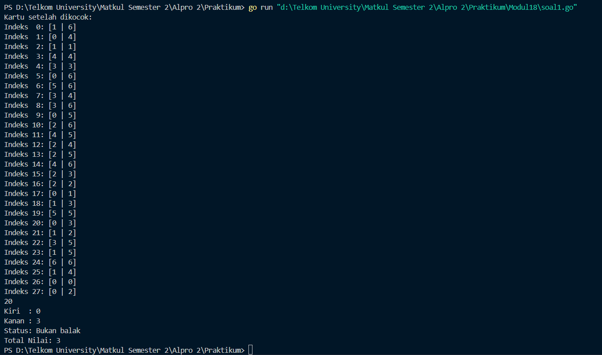
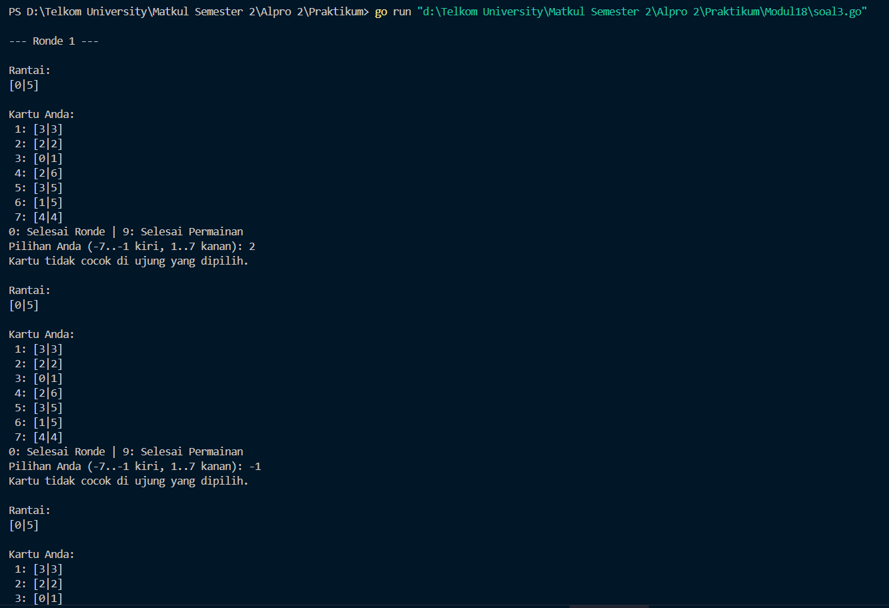
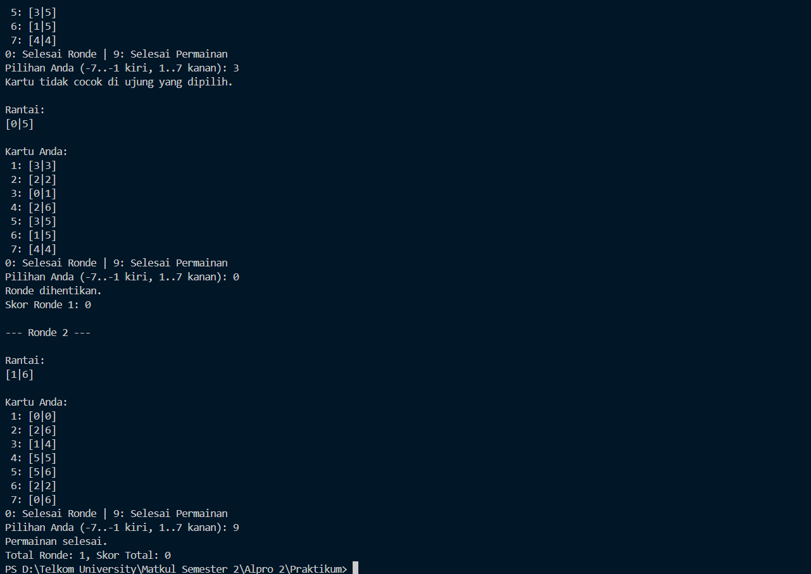
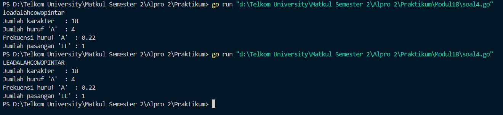

<h1 align="center">Laporan Praktikum Modul 18 
<br>MESIN ABSTRAK</h1>


<p align="center"> Faiz Az-Zahra Winanto Putra - 103112430001 </p>

## Dasar Teori 

Model komputasi terdiri dari data yang dapat diolah dan operasi-operasi dasar pengolahan data tersebut. Mesin abstrak adalah model komputasi yang dirancang di atas model mesin komputasi yang telah ada, yaitu tipe data dan operasi-operasi dasarnya dibuat menggunakan tipe data dan operasi-operasi yang tersedia di mesin di bawahnya. Teknik ini merupakan salah satu cara untuk membangun perangkat lunak.

### Unguided

#### Soal Latihan Modul 18

##### Soal 1
>Implementasi operasi dasar mesin domino sebagai sebuah subprogram:

```
a) Buat tipe data kartu domino (Domino) yang menyimpan informasi ➢ gambar (suit) kedua sisi kartu ➢ nilai kartu ➢ Boolean data yang menyatakan kartu ini balak atau bukan ➢ Buat tipe data satu set kartu domino (Dominoes) ➢ Array menyimpan 28 kartu Domino ➢ Jumlah kartu tersisa dalam array tersebut

b) prosedur kocokKartu(Dominoes) 
c) fungsi ambilKartu(Dominoes) → Domino 
d) fungsi gambarKartu(Domino,suit int) → int 
e) fungsi nilaiKartu(Domino) → int
```

```go
package main

import (
    "fmt"
    "math/rand"
    "time"
)

  
type Domino struct {
    kiri  int
    kanan int
    balak bool
}

  
func buatSetKartuDomino() []Domino {
    var dominoSet []Domino
    var i, j int
    var kartu Domino


    for i = 0; i <= 6; i++ {
        for j = i; j <= 6; j++ {
            kartu = Domino{
                kiri:  i,
                kanan: j,
                balak: i == j,
            }
            dominoSet = append(dominoSet, kartu)
        }
    }
    return dominoSet
}

  
func kocokKartu(kartu []Domino) {
    var seed int64
    seed = time.Now().UnixNano()
    rand.Seed(seed)

    rand.Shuffle(len(kartu), func(i, j int) {
        var temp Domino
        temp = kartu[i]
        kartu[i] = kartu[j]
        kartu[j] = temp
    })
}

  
func ambilKartu(kartu []Domino, index int) Domino {
    var hasil Domino
    hasil = kartu[index]
    return hasil
}

  
func cekBalak(kartu Domino) bool {
    var hasil bool
    hasil = kartu.balak
    return hasil
}

  
func totalNilai(kartu Domino) int {
    var jumlah int
    jumlah = kartu.kiri + kartu.kanan
    return jumlah
}

  
func main() {
    var semuaKartu []Domino
    var index, i int
    var kartu Domino

    semuaKartu = buatSetKartuDomino()
    kocokKartu(semuaKartu)

    fmt.Println("Kartu setelah dikocok:")

    for i = 0; i < len(semuaKartu); i++ {
        fmt.Printf("Indeks %2d: [%d | %d]\n", i, semuaKartu[i].kiri, semuaKartu[i].kanan)
    }

    fmt.Scan(&index)

  
    if index < 0 || index >= len(semuaKartu) {
        fmt.Println("Indeks tidak valid!")
        return
    }

  
    kartu = ambilKartu(semuaKartu, index)
  
    fmt.Printf("Kiri  : %d\n", kartu.kiri)
    fmt.Printf("Kanan : %d\n", kartu.kanan)

  
    if cekBalak(kartu) {
        fmt.Println("Status: Balak")
    } else {
        fmt.Println("Status: Bukan balak")
    }
    fmt.Printf("Total Nilai: %d\n", totalNilai(kartu))
}
```



Program Go di atas merupakan simulasi permainan kartu **domino** sederhana. Program ini dimulai dengan mendefinisikan sebuah struct `Domino`, yang merepresentasikan satu buah kartu domino dengan dua sisi (`kiri` dan `kanan`), serta atribut boolean `balak` yang menunjukkan apakah kartu tersebut balak (memiliki nilai kiri dan kanan yang sama).


##### Soal 2
>Realisasi aksi berikut menggunakan operasi-operasi dasar mesin domino:
>
>a) prosedur galiKartu(Dominoes,Domino) yang mengambil kartu dari tumpukan sampai diperoleh kartu dengan gambar (suit) yang sama dengan kartu yang diberikan
>
>b) fungsi sepasangKartu(Domino,Domino) → boolean; yang memberikan nilai true jika total nilai kartu adalah 12 dan false jika tidak.


```go
package main
 

import (
    "fmt"
    "math/rand"
    "time"
)

  
type Domino struct {
    kiri  int
    kanan int
    balak bool
}

  
func buatSetKartuDomino() []Domino {
    var set []Domino
    for i := 0; i <= 6; i++ {
        for j := i; j <= 6; j++ {
            set = append(set, Domino{
                kiri:  i,
                kanan: j,
                balak: i == j,
            })
        }
    }
    return set
}

  
func kocokKartu(kartu []Domino) {
    rand.Seed(time.Now().UnixNano())
    rand.Shuffle(len(kartu), func(i, j int) {
        kartu[i], kartu[j] = kartu[j], kartu[i]
    })
}

  
func ambilKartu(kartu []Domino, index int) Domino {
    return kartu[index]
}

  
func cekBalak(k Domino) bool {
    return k.balak
}

  
func totalNilai(k Domino) int {
    return k.kiri + k.kanan
}

  
func galiKartu(tumpukan *[]Domino, acuan Domino) (Domino, bool) {
    for len(*tumpukan) > 0 {
        kartu := (*tumpukan)[len(*tumpukan)-1]
        *tumpukan = (*tumpukan)[:len(*tumpukan)-1]
        
        if kartu.kiri == acuan.kiri || kartu.kanan == acuan.kanan ||
            kartu.kiri == acuan.kanan || kartu.kanan == acuan.kiri {
            return kartu, true
        }
    }
    return Domino{}, false
}

  
func sepasangKartu(k1, k2 Domino) bool {
    return (k1.kiri + k1.kanan + k2.kiri + k2.kanan) == 12
}

  
func main() {
    kartuDomino := buatSetKartuDomino()
    kocokKartu(kartuDomino)


    fmt.Println("Daftar kartu setelah dikocok:")
    for i, d := range kartuDomino {
        fmt.Printf("Indeks %2d: [%d|%d]\n", i, d.kiri, d.kanan)
    }

    var index int
    fmt.Scan(&index)
    if index < 0 || index >= len(kartuDomino) {
        fmt.Println("Indeks tidak valid!")
        return
    }
    kartu := ambilKartu(kartuDomino, index)
    fmt.Printf("Kartu yang diambil: [%d|%d]\n", kartu.kiri, kartu.kanan)
    fmt.Printf("Status: %s\n", map[bool]string{true: "Balak", false: "Bukan balak"}[cekBalak(kartu)])
    fmt.Printf("Total Nilai: %d\n", totalNilai(kartu))

    acuan := kartu

    kartuDitemukan, ditemukan := galiKartu(&kartuDomino, acuan)
    
    if ditemukan {
        fmt.Printf("Kartu yang cocok ditemukan: [%d|%d]\n", kartuDitemukan.kiri, kartuDitemukan.kanan)
    } else {
        fmt.Println("Tidak ditemukan kartu yang cocok.")
    }

  

    fmt.Println("\nCek apakah dua kartu berjumlah 12:")
    var a1, b1, a2, b2 int
    fmt.Print("Masukkan kartu pertama (kiri kanan): ")
    fmt.Scan(&a1, &b1)
    fmt.Print("Masukkan kartu kedua (kiri kanan): ")
    fmt.Scan(&a2, &b2)

  
    k1 := Domino{kiri: a1, kanan: b1}
    k2 := Domino{kiri: a2, kanan: b2}

  
    if sepasangKartu(k1, k2) {
        fmt.Println("Sepasang kartu ini berjumlah 12.")
    } else {
        fmt.Println("Sepasang kartu ini TIDAK berjumlah 12.")
    }
}
```


Program Go di atas merupakan versi yang lebih **kompleks dan interaktif** dari permainan kartu **Domino**. Program ini tidak hanya membuat dan mengacak set kartu domino, tetapi juga menambahkan fitur pencocokan kartu dan pengecekan kombinasi nilai kartu.
##### Soal 3
>Implementasi salah satu permainan domino. Lihat lampiran untuk deskripsi permainan Gapleh.


```go
package main
  
import (
    "fmt"
    "math/rand"
    "time"
)

  
type Domino struct {
    kiri  int
    kanan int
}

  
func buatSetKartuDomino() []Domino {
    var set []Domino
    for i := 0; i <= 6; i++ {
        for j := i; j <= 6; j++ {
            set = append(set, Domino{i, j})
        }
    }
    return set
}

  
func kocokKartu(kartu []Domino) {
    rand.Seed(time.Now().UnixNano())
    rand.Shuffle(len(kartu), func(i, j int) {
        kartu[i], kartu[j] = kartu[j], kartu[i]
    })
}

  
func cocok(kartu Domino, ujung int) bool {
    return kartu.kiri == ujung || kartu.kanan == ujung
}

  
func balikKartu(kartu Domino) Domino {
    return Domino{kartu.kanan, kartu.kiri}
}

  
func tampilkanKartu(kartu Domino) string {
    return fmt.Sprintf("[%d|%d]", kartu.kiri, kartu.kanan)
}

  
func main() {
    set := buatSetKartuDomino()
    ronde := 0
    skorTotal := 0

  
    for {
        ronde++
        fmt.Printf("\n--- Ronde %d ---\n", ronde)
        kocokKartu(set)

  
        tumpukan := append([]Domino(nil), set...)
        pemain := tumpukan[:7]
        tumpukan = tumpukan[7:]

  
        ranrai := []Domino{tumpukan[0]}
        tumpukan = tumpukan[1:]
        skor := 0

        for {
            fmt.Println("\nRantai:")
            for _, k := range ranrai {
                fmt.Print(tampilkanKartu(k), " ")
            }
            fmt.Println("\n\nKartu Anda:")
            for i, k := range pemain {
                fmt.Printf("%2d: %s\n", i+1, tampilkanKartu(k))
            }

            fmt.Println("0: Selesai Ronde | 9: Selesai Permainan")
            fmt.Print("Pilihan Anda (-7..-1 kiri, 1..7 kanan): ")

            var pilih int
            fmt.Scan(&pilih)


            if pilih == 0 {
                fmt.Println("Ronde dihentikan.")
                break
            } else if pilih == 9 {
                fmt.Println("Permainan selesai.")
                fmt.Printf("Total Ronde: %d, Skor Total: %d\n", ronde-1, skorTotal)
                return
            } else if pilih < -7 || pilih > 7 || pilih == 0 {
                fmt.Println("Pilihan tidak valid.")
                continue
            }

            abs := pilih

            if abs < 0 {
                abs = -abs
            }

            if abs > len(pemain) {
                fmt.Println("Indeks kartu tidak tersedia.")
                continue
            }

            kartuPilihan := pemain[abs-1]
            bisaMain := false

            if pilih < 0 {
                ujung := ranrai[0].kiri
                if cocok(kartuPilihan, ujung) {
                    if kartuPilihan.kanan == ujung {
                        ranrai = append([]Domino{kartuPilihan}, ranrai...)
                    } else {
                        ranrai = append([]Domino{balikKartu(kartuPilihan)}, ranrai...)
                    }
                    bisaMain = true
                }
            } else {
                ujung := ranrai[len(ranrai)-1].kanan
                if cocok(kartuPilihan, ujung) {
                    if kartuPilihan.kiri == ujung {
                        ranrai = append(ranrai, kartuPilihan)
                    } else {
                        ranrai = append(ranrai, balikKartu(kartuPilihan))
                    }
                    bisaMain = true
                }
            }

  
            if bisaMain {
                pemain = append(pemain[:abs-1], pemain[abs:]...)
                skor++
            } else {
                fmt.Println("Kartu tidak cocok di ujung yang dipilih.")
            }
            if len(pemain) == 0 {
                fmt.Println("Semua kartu habis. Ronde selesai!")
                break
            }
        }
        fmt.Printf("Skor Ronde %d: %d\n", ronde, skor)
        skorTotal += skor
    }
}
```




Program ini adalah contoh menarik dari penerapan konsep **slice**, **perulangan**, **pengacakan**, dan **input pengguna** dalam bahasa Go. Fitur interaktif seperti pemilihan kartu, pengecekan validitas langkah, serta pencatatan skor menjadikan permainan ini sederhana namun menyenangkan, sekaligus memberikan gambaran nyata tentang bagaimana struktur data dan logika kontrol dapat digunakan untuk membuat permainan berbasis teks.


##### Soal 4
>Implementasi mesin abstrak karakter yang bekerja terhadap untaian karakter (yang diakhiri dengan penanda titik (".") dan mempunyai sejumlah operasi dasar.
>
>a) Operasi dasar mesin karakter: 
>➢ Prosedur start(); yang menyiapkan mesin karakter di awal rangkaian karakter. 
>➢ Prosedur maju(); yang memajukan pembaca ke posisi karakter berikutnya. 
>➢ Fungsi eop(); yang mengembalikan nilai true apabila sudah mencapai akhir rangkaian, sampai ke penanda titik ("."). 
>➢ Fungsi cc(); yang mengembalikan karakter yang sedang terbaca, atau berada pada posisi pembacaan mesin.
>
>b) Dengan operasi dasar di atas buat algoritma untuk: 
>➢ Membaca seluruh karakter yang diberikan ke mesin karakter tersebut. 
>➢ Menghitung berapa banyak karakter yang terbaca. 
>➢ Menghitung ada berapa huruf "A" yang terbaca. 
>➢ Menghitung frekuensi kemunculan huruf "A" terhadap seluruh karakter terbaca. 
>➢ Menghitung ada berapa kata "LE" (pasangan berturutan huruf "L" dan "E") yang terbaca.


```go
package main
import "fmt"

type MesinKarakter struct {
    teks   []rune
    posisi int
}

func (m *MesinKarakter) start(teks string) {
    m.teks = []rune(teks)
    m.posisi = 0
}

func (m *MesinKarakter) maju() {
    if !m.eop() {
        m.posisi++
    }
}

func (m *MesinKarakter) eop() bool {
    return m.posisi >= len(m.teks) || m.teks[m.posisi] == '.'
}

func (m *MesinKarakter) cc() rune {
    if m.eop() {
        return 0
    }
    return m.teks[m.posisi]
}

func bacaSemuaKarakter(m *MesinKarakter) string {
    hasil := ""
    mulai := *m
    for !mulai.eop() {
        hasil += string(mulai.cc())
        mulai.maju()
    }
    return hasil
}

func hitungJumlahKarakter(m *MesinKarakter) int {
    hitung := 0
    mulai := *m
    for !mulai.eop() {
        hitung++
        mulai.maju()
    }
    return hitung
}

func hitungJumlahA(m *MesinKarakter) int {
    jumlah := 0
    mulai := *m
    for !mulai.eop() {
        c := mulai.cc()
        if c == 'A' || c == 'a' {
            jumlah++
        }
        mulai.maju()
    }
    return jumlah
}

func hitungFrekuensiA(m *MesinKarakter) float64 {
    total := hitungJumlahKarakter(m)
    if total == 0 {
        return 0
    }
    jumlahA := hitungJumlahA(m)
    return float64(jumlahA) / float64(total)
}

func hitungJumlahLE(m *MesinKarakter) int {
    jumlah := 0
    mulai := *m
    for !mulai.eop() && mulai.posisi < len(mulai.teks)-1 {
        c1 := mulai.cc()
        c2 := mulai.teks[mulai.posisi+1]
        if (c1 == 'L' || c1 == 'l') && (c2 == 'E' || c2 == 'e') {
            jumlah++
        }
        mulai.maju()
    }
    return jumlah
}

func main() {
    var input string
    fmt.Scanln(&input)

    mesin := MesinKarakter{}
    mesin.start(input)

    fmt.Println("Jumlah karakter       :", hitungJumlahKarakter(&mesin))
    fmt.Println("Jumlah huruf 'A'      :", hitungJumlahA(&mesin))
    fmt.Printf("Frekuensi huruf 'A'   : %.2f\n", hitungFrekuensiA(&mesin))
    fmt.Println("Jumlah pasangan 'LE'  :", hitungJumlahLE(&mesin))
}
```



Program ini merupakan implementasi yang sangat baik untuk memahami bagaimana **simulasi mesin baca karakter bekerja**, mirip dengan state machine. Ini sangat cocok untuk digunakan dalam analisis string atau pengolahan bahasa dasar, terutama dalam konteks **pembelajaran dasar algoritma** dan pengenalan pemrograman prosedural.


