<h1 align="center">Laporan Praktikum Modul 2  
<br>Review Pengenalan Pemrograman</h1>


<p align="center"> Faiz Az-Zahra Winanto Putra - 103112430001 </p>

### Dasar Teori 
Bahasa Pemrograman Go adalah bahasa pemrograman sederhana namun kuat dengan aturan penulisan yang jelas. Setiap program utama harus memiliki _package_ `main` dan fungsi `main()` sebagai titik eksekusi. Pengembangannya meliputi penulisan kode `.go`, kompilasi dengan go build, dan eksekusi via terminal. Go mendukung berbagai tipe data seperti integer, float, boolean, dan string, serta memiliki kontrol alur dengan for, if-else, dan switch-case.

### Unguided

#### Soal Latihan 2A

##### Soal 1
>Telusuri program berikut dengan cara mengkompilasi dan mengeksekusi program. Silakan masukan data yang sesuai sebanyak yang diminta program. Perhatikan keluaran yang diperoleh. Coba terangkan apa sebenarnya yang dilakukan program tersebut?

```go
package main

  

import "fmt" 

func main() {

var (

 satu, dua, tiga string

 temp string

 )

fmt.Print("Masukan input string: ")

fmt.Scanln(&satu)

  

fmt.Print("Masukan input string: ")

fmt.Scanln(&dua)

  

fmt.Print("Masukan input string: ")

fmt.Scanln(&tiga)
  

fmt.Println("Output awal = " + satu + " " + dua + " " + tiga)

temp = satu

satu = dua

dua = tiga

tiga = temp


fmt.Println("Output akhir = " + satu + " " + dua + " " + tiga)
}
```

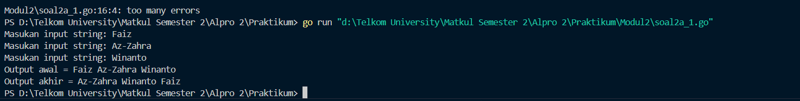

Program diatas merupakan program yang akan meminta 3 inputan dari user, lalu menukar urutannya dengan disusun secara berurutan, sesuai dengan urutan ketika kita memasukan inputan ke program di awal. Proses tukar menukar dilakukan dengan menggunakan variabel sementara
`temp`, sehingga urutan `(satu, dua, tiga)` berubah menjadi `(dua, tiga, satu)`.

##### Soal 2
>Tahun kabisat adalah tahun yang habis dibagi 400 atau habis dibagi 4 tetapi tidak habis dibagi 100. Buatlah sebuah program yang menerima input sebuah bilangan bulat dan memeriksa apakah bilangan tersebut merupakan tahun kabisat (true) atau bukan (false).

```go
package main

import "fmt"

func main(){
    var(
        tahun int
        kabisat bool
    )


    fmt.Print("Masukan tahun: ")

    fmt.Scanln(&tahun)


    if tahun%400 == 0 || tahun%4 == 0 && tahun%100 != 0 {

        kabisat = true

    } else {

        kabisat = false

    }

    fmt.Println("Tahun:", tahun)

    fmt.Println("Kabisat:", kabisat)

}
```

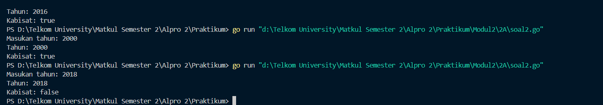

Program ini  merupakan validasi tahun kabisat atau tidak pada program diatas menggunakan percabangan jika tahun yang diinputkan habis dibagi 400 atau habis dibagi 4 tetapi tidak habis dibagi 100 -> maka itu adalah tahun kabisat jika tidak itu bukan tahun kabisat

```go
if tahun%400 == 0 || tahun%4 == 0 && tahun%100 != 0 {
        kabisat = true
    } else {
        kabisat = false
    }
```

kunci pada program tersebut ada di blok kode diatas
>`tahun%400 == 0` jika tahun bisa habis dibagi 400
>`||` (operator logika atau)
>`tahun%4 == 0 && tahun%100 != 0` merupakan inisialisasi tahun bisa habis dibagi 4 `&&` jika tidak habis dibagi 100 maka bukan tahun kabisat

ketika kondisi memenuhi pada inisialisasi diatas akan memunculkan true dan jika tidak memenuhi akan memunculkan ouput false

##### Soal 3
>Buat program Bola yang menerima input jari-jari suatu bola (bilangan bulat). Tampilkan Volume dan Luas kulit bola. 𝑣𝑜𝑙𝑢𝑚𝑒𝑏𝑜𝑙𝑎 = 4 3 𝜋𝑟 3 dan 𝑙𝑢𝑎𝑠𝑏𝑜𝑙𝑎 = 4𝜋𝑟 2 (π ≈ 3.1415926535).

```go
package main

import (
    "fmt"
    "math"
)

func main() {
    var (
        jari,
        volumeBola,
        luasBola float64

    )


    fmt.Println("Masukkan jari-jari bola: ")
    fmt.Scan(&jari)

    volumeBola = (4.0 / 3.0) * math.Pi * math.Pow(jari, 3)
    luasBola = 4 * math.Pi * math.Pow(jari, 2)
    fmt.Printf("Volume bola = %.4f\n", volumeBola)

    fmt.Printf("Luas bola = %.4f\n", luasBola)

}
```

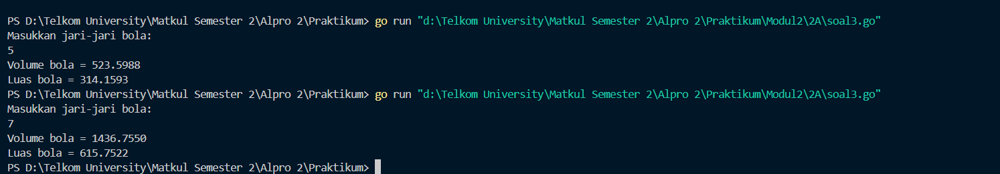

Program Go ini menghitung volume dan luas permukaan bola berdasarkan jari-jari yang diinputkan oleh user. Dengan menggunakan import `"math"`, program meminta input jari-jari, lalu menghitung volume dengan menggunakan rumus (4/3)×π×r^3 dan luas permukaan dengan (4×π×r^2). maka program akan menampilkan dengan format empat angka di belakang koma menggunakan `fmt.Printf()`.
##### Soal 4
>Dibaca nilai temperatur dalam derajat Celsius. Nyatakan temperatur tersebut dalam Fahrenheit 𝐶𝑒𝑙𝑠𝑖𝑢𝑠 = (𝐹𝑎ℎ𝑟𝑒𝑛ℎ𝑒𝑖𝑡 − 32) × 5/9 𝑅𝑒𝑎𝑚𝑢𝑟 = 𝐶𝑒𝑙𝑐𝑖𝑢𝑠 × 4/5 𝐾𝑒𝑙𝑣𝑖𝑛 = (𝐹𝑎ℎ𝑟𝑒𝑛ℎ𝑒𝑖𝑡 + 459.67) × 5/9

```go
package main
import "fmt"

func main() {
    var (
        farenhit,
        reamur,
        kelvin,
        celcius float32
    )
    fmt.Println("Masukan Suhu Celcius")
    fmt.Scan(&celcius)

  
    reamur = celcius * 4 / 5
    farenhit = (celcius * 9/5) + 32
    kelvin = celcius + 273

    fmt.Println("Derajat Reamur :", reamur)
    fmt.Println("Derajat Farenhit :", farenhit)
    fmt.Println("Derajat Kelvin :", kelvin)

}
```

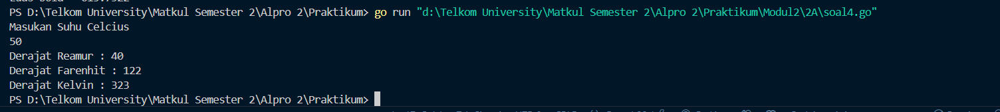

Program ini adalah program untuk mengkonversi suhu dari Celsius ke Reamur, Fahrenheit, dan Kelvin. Pertama program akan meminta pengguna untuk menginputkan suhu dalam Celsius melalui `fmt.Scan(&celcius)`. Selanjutnya dikonversi dengan rumus:

- **Reamur** = Celsius * 4/5
- **Fahrenheit** = (Celsius*9/5) + 32
- **Kelvin** = Celsius+273

Kemudian program akan menampilkan hasil yang telah dikonversikan dengan menggunakan    

- fmt.Println("Derajat Reamur :", reamur)
- fmt.Println("Derajat Farenhit :", farenhit)
- fmt.Println("Derajat Kelvin :", kelvin)
##### Soal 5
>Tipe karakter sebenarnya hanya apa yang tampak dalam tampilan. Di dalamnya tersimpan dalam bentuk biner 8 bit (byte) atau 32 bit (rune) saja. Buat program ASCII yang akan membaca 5 buat data integer dan mencetaknya dalam format karakter. Kemudian membaca 3 buah data karakter dan mencetak 3 buah karakter setelah karakter tersebut (menurut tabel ASCII) Masukan terdiri dari dua baris. Baris pertama berisi 5 buah data integer. Data integer mempunyai nilai antara 32 s.d. 127. Baris kedua berisi 3 buah karakter yang berdampingan satu dengan yang lain (tanpa dipisahkan spasi). Keluaran juga terdiri dari dua baris. Baris pertama berisi 5 buah representasi karakter dari data yang diberikan, yang berdampingan satu dengan lain, tanpa dipisahkan spasi. Baris kedua berisi 3 buah karakter (juga tidak dipisahkan oleh spasi).

```go
package main
import "fmt"

  
func main() {
    var k1, k2, k3, k4, k5 int
    var h1, h2, h3 rune

    fmt.Scan(&k1, &k2, &k3, &k4, &k5)
    fmt.Scanf("\n%c%c%c", &h1, &h2, &h3)


    fmt.Printf("%c%c%c%c%c\n", k1, k2, k3, k4, k5)
    fmt.Printf("%c%c%c\n", h1+1, h2+1, h3+1)

}
```

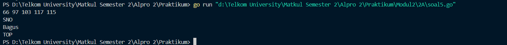

Program ini berfungsi untuk membaca lima kode ASCII yang kemudian langsung dikonversi menjadi karakter dan digabungkan menjadi sebuah kata. Selain itu, program ini juga dapat menggeser karakter dalam sebuah kata. Misalnya, jika kata yang dimasukkan adalah "SNO", maka setelah dijalankan, setiap huruf akan bergeser satu posisi ke depan dalam tabel ASCII: 'S' menjadi 'T', 'N' menjadi 'O', dan 'O' menjadi 'P'. Perubahan ini terjadi karena karakter disimpan dalam tipe data `rune`, yang memungkinkan operasi aritmatika langsung pada nilai ASCII-nya.
#### Soal Latihan 2B

##### Soal 1
>Siswa kelas IPA di salah satu sekolah menengah atas di Indonesia sedang mengadakan praktikum kimia. Di setiap percobaan akan menggunakan 4 tabung reaksi, yang mana susunan warna cairan di setiap tabung akan menentukan hasil percobaan. Siswa diminta untuk mencatat hasil percobaan tersebut. Percobaan dikatakan berhasil apabila susunan warna zat cair pada gelas 1 hingga gelas 4 secara berturutan adalah ‘merah’, ‘kuning’, ‘hijau’, dan ‘ungu’ selama 5 kali percobaan berulang. Buatlah sebuah program yang menerima input berupa warna dari ke 4 gelas reaksi sebanyak 5 kali percobaan. Kemudian program akan menampilkan true apabila urutan warna sesuai dengan informasi yang diberikan pada paragraf sebelumnya, dan false untuk urutan warna lainnya.

```go
package main
import "fmt"

func main() {

    var gelas1, gelas2, gelas3, gelas4 string
    var berhasil bool

    berhasil = true

  
    for i := 1; i <= 5; i++ {
        fmt.Print("Percobaan ", i, ": ")
        fmt.Scan(&gelas1, &gelas2, &gelas3, &gelas4)

      if !(gelas1 == "merah" && gelas2 == "kuning" && gelas3 == "hijau" && gelas4 == "ungu") {

           berhasil = false
        }
    }

    fmt.Print("Berhasil: ", berhasil)
}
```

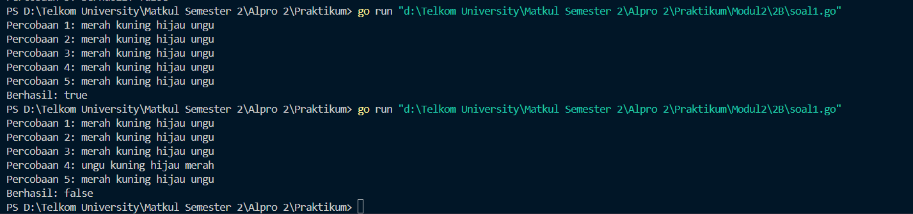

Program ini berfungsi untuk menentukan keberhasilan percobaan kimia berdasarkan susunan warna dalam empat gelas. Dalam lima kali percobaan, pengguna diminta memasukkan urutan warna. Jika seluruh percobaan memiliki urutan warna yang tepat, yaitu **"merah, kuning, hijau, ungu"**, maka percobaan dinyatakan berhasil (true). Namun, jika ada satu saja percobaan yang tidak sesuai dengan urutan tersebut, maka percobaan dianggap gagal (false). Program ini memastikan konsistensi dalam setiap percobaan sebelum memberikan hasil akhir.
##### Soal 2
>Suatu pita (string) berisi kumpulan nama-nama bunga yang dipisahkan oleh spasi dan ‘– ‘, contoh pita diilustrasikan seperti berikut ini. Pita: mawar – melati – tulip – teratai – kamboja – anggrek Buatlah sebuah program yang menerima input sebuah bilangan bulat positif (dan tidak nol) N, kemudian program akan meminta input berupa nama bunga secara berulang sebanyak N kali dan nama tersebut disimpan ke dalam pita. (Petunjuk: gunakan operasi penggabungan string dengan operator “+” ). Tampilkan isi pita setelah proses input selesai.

```go
package main
import "fmt"

func main() {
    var bunga, pita string
    var jumlah int

    jumlah = 0


    for {
        fmt.Print("Bunga ", jumlah+1, ": ")
        fmt.Scan(&bunga)

        // ketika mengetikan selesai, maka program selesai
        if bunga == "selesai" {
            break
        }

        // Digunakan untuk menambahkan setiap masukan yang dimasukan
        pita = pita + bunga + " - "
        jumlah++
    }

    fmt.Println("Pita:", pita)
    fmt.Println("Bunga:", jumlah)
}
```

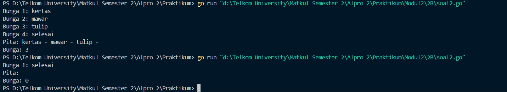

Program Go ini untuk mencatat daftar bunga yang diinputkan pengguna hingga mengetik "selesai". Setiap nama bunga ditambahkan ke variabel `pita`, dipisahkan dengan `" - "`, sementara `jumlah` menghitung total bunga yang dimasukkan. Perulangan berjalan terus hingga "selesai" diketik, lalu program mencetak daftar bunga dan jumlahnya.
##### Soal 3
>Setiap hari Pak Andi membawa banyak barang belanjaan dari pasar dengan mengendarai sepeda motor. Barang belanjaan tersebut dibawa dalam kantong terpal di kiri-kanan motor. Sepeda motor tidak akan oleng jika selisih berat barang di kedua kantong sisi tidak lebih dari 9 kg. Buatlah program Pak Andi yang menerima input dua buah bilangan real positif yang menyatakan berat total masing-masing isi kantong terpal. Program akan terus meminta input bilangan tersebut hingga salah satu kantong terpal berisi 9 kg atau lebih.

```go
package main
import "fmt"

func main() {
    var kantong1, kantong2, selisih float32
    var oleng bool

    for {
        fmt.Print("Masukan berat belanjaan di kedua kantong: ")
        fmt.Scan(&kantong1, &kantong2)

        // jika kantong 1 ataupun kantong 2 kurang dari 0 maka program selesai
        if kantong1 < 0 || kantong2 < 0 {
            fmt.Println("Proses selesai")
            break
        }

        // jika jumlah kedua kanton lebih dari 150 maka program selesai

        if kantong1+kantong2 > 150 {
            fmt.Println("Proses selesai")
            break

        }

        // digunakan untuk menentukan selisih antara kantong

        if kantong1 > kantong2 {
            selisih = kantong1 - kantong2
        } else {
            selisih = kantong2 - kantong1
        }
  

        oleng = selisih >= 9
        fmt.Println("Sepeda motor pak Andi akan oleng:", oleng)

    }
}
```

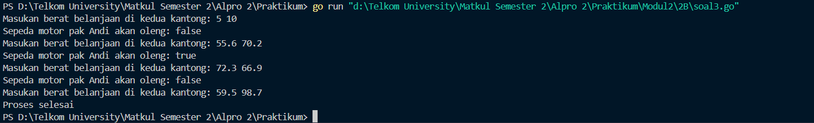

Program ini untuk mengecek keseimbangan  sepeda motor Pak Andi berdasarkan perbedaan berat belanjaan di dua kantong. Program meminta pengguna untuk memasukkan berat belanjaan untuk **kantong1** dan **kantong2**. 

Jika salah satu berat bernilai negatif atau total berat melebihi **150**, program akan berhenti dengan menampilkan **"Proses selesai"**. Selisih berat antara kedua kantong dihitung, dan jika selisihnya **9 atau lebih**, variabel **oleng** diset ke `true`, menandakan motor akan oleng. Program terus meminta input hingga kondisi berhenti terpenuhi.
##### Soal 4
>Diberikan sebuah persamaan sebagai berikut ini. 𝑓(𝑘) = (4𝑘 + 2) 2 (4𝑘 + 1)(4𝑘 + 3) Buatlah sebuah program yang menerima input sebuah bilangan sebagai K, kemudian menghitung dan menampilkan nilai f(K) sesuai persamaan di atas.

```go
package main
import (
    "fmt"
    "math"
)

  
func main() {
    var k int

  
    fmt.Print("Nilai K: ")
    fmt.Scan(&k)


    result := 1.0


    for i := 0; i < k; i++ {
        numerator := math.Pow(float64(4*i+2), 2)
        denumerator := float64((4*i + 1) * (4*i + 3))
        result *= numerator / denumerator
    }

    fmt.Printf("Hasil dari operasi fungsi = %.10f\n", result)
}
```

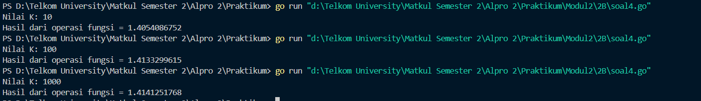

Program ini menghitung hasil dari operasi matematika berdasarkan nilai **K** yang dimasukkan oleh pengguna. Pertama, program akan meminta pengguna untuk memasukkan nilai **K**, yang menentukan jumlah iterasi dalam perulangan.

Dalam perulangan **for**, program menghitung pecahan menggunakan rumus:

f(k) (4k + 2)^2 /(4k+1)(4k+3)

Setelah perulangan selesai, program mencetak hasil akhir dengan **10 angka desimal**.
#### Soal Latihan 2C

##### Soal 1
>PT POS membutuhkan aplikasi perhitungan biaya kirim berdasarkan berat parsel. Maka, buatlah program BiayaPos untuk menghitung biaya pengiriman tersebut dengan ketentuan sebagai berikut! Dari berat parsel (dalam gram), harus dihitung total berat dalam kg dan sisanya (dalam gram). Biaya jasa pengiriman adalah Rp. 10.000,- per kg. Jika sisa berat tidak kurang dari 500 gram, maka tambahan biaya kirim hanya Rp. 5,- per gram saja. Tetapi jika kurang dari 500 gram, maka tambahan biaya akan dibebankan sebesar Rp. 15,- per gram. Sisa berat (yang kurang dari 1kg) digratiskan biayanya apabila total berat ternyata lebih dari 10kg.

```go
package main
import "fmt"


func main() {
    var (
        gram, kg, total int
    )

  

    fmt.Print("Masukan berat (Satuan Gram): ")
    fmt.Scan(&gram)


    kg = gram / 1000
    gram = gram % 1000
    total = kg * 10000


    if kg <= 10 {
        if gram >= 500 {
            total = total + (gram * 5)
        } else {
            total = total + (gram * 15)
        }
        fmt.Print(total)
    } else {
        fmt.Println(total)
    }
}
```

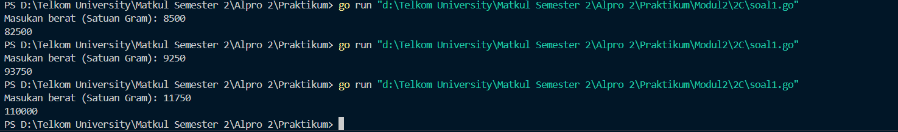

Program ini menghitung biaya berdasarkan berat dalam gram. Berat dikonversi ke kilogram, lalu dihitung biaya awal dengan **10.000 per kg**. Jika berat **≤ 10 kg**, sisa gram dikenai tarif tambahan: **5 per gram** jika **≥ 500 gram**, atau **15 per gram** jika kurang. Jika berat melebihi **10 kg**, biaya langsung dicetak tanpa tambahan.
##### Soal 2
>Jawablah pertanyaan-pertanyaan berikut: a. Jika nam diberikan adalah 80.1, apa keluaran dari program tersebut? Apakah eksekusi program tersebut sesuai spesifikasi soal? b. Apa saja kesalahan dari program tersebut? Mengapa demikian? Jelaskan alur program seharusnya! c. Perbaiki program tersebut! Ujilah dengan masukan: 93.5; 70.6; dan 49.5. Seharusnya keluaran yang diperoleh adalah ‘A’, ‘B’, dan ‘D’.

###### Kode Awal
```go
package main
import “fmt”
func main() {
 var nam float64
 var nmk string
 fmt.Print(“Nilai akhir mata kuliah: “)
 fmt.Scanln(&nam)
 if nam > 80 {
 nam = “A”
 }
 if nam > 72.5 {
 nam = “AB”
 }
 if nam > 65 {
 nam = “B”
 }
 if nam > 57.5 {
 nam = “BC”
 }
 if nam > 50 {
 nam = “C”
 }
 if nam > 40 {
 nam = “D”
 } else if nam <= 40 {
 nam = “E”
 }
 fmt.Println(“Nilai mata kuliah: “, nmk)
}
```

###### Kode yang sudah diperbaiki
```go
package main  
import "fmt"
 

func main() {
    var nam float64
    var nmk string

  
    fmt.Print("Nilai akhir mata kuliah: ")
    fmt.Scanln(&nam)


    if nam > 80 {
        nmk = "A"
    } else if nam > 72.5 && nam <= 80 {
        nmk = "AB"
    } else if nam > 65 && nam <= 72.5 {
        nmk = "B"
    } else if nam > 57.5 && nam <= 65 {
        nmk = "BC"
    } else if nam > 50 && nam <= 57.5 {
        nmk = "C"
    } else if nam > 40 && nam <= 50 {
        nmk = "D"
    } else if nam <= 40 {
        nmk = "E"
    }

    fmt.Println("Nilai mata kuliah:", nmk)

}
```

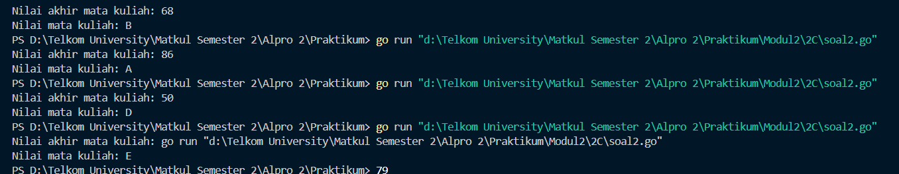

a. Saat program pertama kali dijalankan, output yang dihasilkan tidak sesuai dengan yang diharapkan karena terdapat beberapa kesalahan dalam kode yang perlu diperbaiki.

b. Terdapat beberapa kesalahan dalam program, di antaranya:

- Program menggunakan terlalu banyak percabangan tanpa `else if`, sehingga eksekusi menjadi kurang efisien dan menumpuk.
- Variabel yang digunakan untuk menyimpan output tidak tepat, seharusnya menggunakan `nmk` bertipe `string`, bukan `nam` yang bertipe `float64`.
- Tidak ada batasan yang jelas dalam percabangan, sehingga tidak diketahui rentang nilai untuk kategori A, B, C, D, dan E.
- Penggunaan tanda petik ganda tidak sesuai standar yang benar.

c. Setelah dilakukan perbaikan dan pengujian ulang, program akhirnya menampilkan output yang sesuai dengan yang diharapkan.
##### Soal 3
>Sebuah bilangan bulat b memiliki faktor bilangan f > 0 jika f habis membagi b. Contoh: 2 merupakan faktor dari bilangan 6 karena 6 habis dibagi 2. Buatlah program yang menerima input sebuah bilangan bulat b dan b > 1. Program harus dapat mencari dan menampilkan semua faktor dari bilangan tersebut! Bilangan bulat b > 0 merupakan bilangan prima p jika dan hanya jika memiliki persis dua faktor bilangan saja, yaitu 1 dan dirinya sendiri. Lanjutkan program sebelumnya. Setelah menerima masukan sebuah bilangan bulat b > 0. Program tersebut mencari dan menampilkan semua faktor bilangan tersebut. Kemudian, program menentukan apakah b merupakan bilangan prima.

```go
package main
import "fmt"


func main() {
  
    var bilangan, faktor int
    var prima bool


    fmt.Print("Bilangan: ")
    fmt.Scan(&bilangan)
     fmt.Print("Faktor: ")

    for i := 1; i <= bilangan; i++ {
        if bilangan%i == 0 {
            fmt.Print(i, " ")
            faktor++
        }
    }
    fmt.Println()


    if faktor == 2 {
        prima = true
    } else {
        prima = false
    }

    fmt.Println("Prima:", prima)
}
```

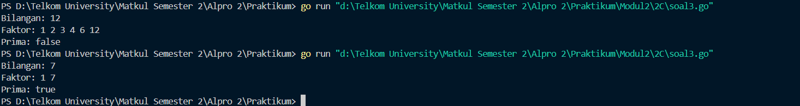

Program ini menentukan faktor-faktor suatu bilangan dan mengecek apakah bilangan tersebut prima. Jika bilangan memiliki tepat **2 faktor** (1 dan dirinya sendiri), maka dianggap **prima** (`true`), selain itu **`false`**.


