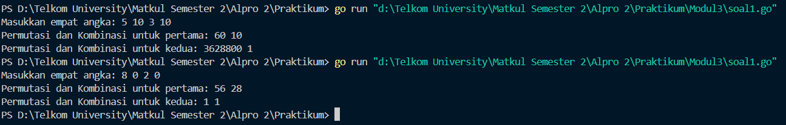
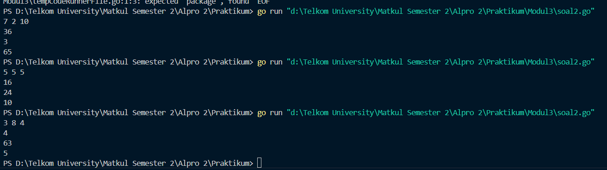
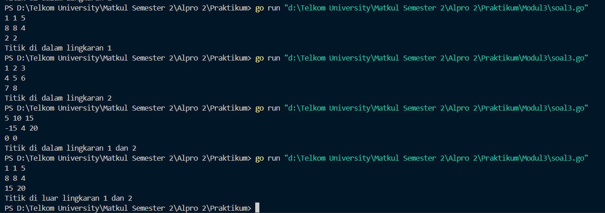

<h1 align="center">Laporan Praktikum Modul 3  
<br>Function (Fungsi)</h1>


<p align="center"> Faiz Az-Zahra Winanto Putra - 103112430001 </p>

### Dasar Teori 

_Fungsi dalam Go (Golang) adalah blok kode yang dapat digunakan kembali yang melakukan tugas tertentu._

Fungsi merupakan bagian mendasar dari program yang kita tulis. Fungsi dapat didefinisikan dan dipanggil seperti dalam banyak bahasa pemrograman lainnya, dan fungsi juga mendukung modularitas dan keterbacaan kode kita. Dalam artikel ini, kita akan mencermati fungsi dan mengeksplorasi beberapa cara penggunaannya.

### Unguided

#### Soal Latihan 2A

##### Soal 1
>Minggu ini, mahasiswa Fakultas Informatika mendapatkan tugas dari mata kuliah matematika diskrit untuk mempelajari kombinasi dan permutasi. Jonas salah seorang mahasiswa, iseng untuk mengimplementasikannya ke dalam suatu program. Oleh karena itu bersediakah kalian membantu Jonas? (tidak tentunya ya :p) 
>
>Masukan terdiri dari empat buah bilangan asli 𝑎, 𝑏, 𝑐, dan 𝑑 yang dipisahkan oleh spasi, dengan syarat 𝑎 ≥ 𝑐 dan 𝑏 ≥ 𝑑. 
>
>Keluaran terdiri dari dua baris. Baris pertama adalah hasil permutasi dan kombinasi 𝒂 terhadap 𝑐, sedangkan baris kedua adalah hasil permutasi dan kombinasi 𝑏 terhadap 𝑑. Catatan: permutasi (P) dan kombinasi (C) dari 𝑛 terhadap 𝑟 (𝑛 ≥ 𝑟) dapat dihitung dengan menggunakan persamaan berikut! 
>

Dengan Rumus
```
P(𝑛,𝑟) = 𝑛!/(𝑛−𝑟)! , sedangkan 𝐶(𝑛,𝑟) = 𝑛!/𝑟!(𝑛−𝑟)!
```

##### SubProgram

```
function factorial(n: integer) → integer {
mengembalikan nilai faktorial dari n} 

function permutation(n,r : integer) → integer 
{Mengembalikan hasil n permutasi r, dan n >= r} 

function combination(n,r : integer) → integer 
```

```go
package main

import (
    "fmt"
)


func main() {
    var x1, x2, y1, y2 int
    fmt.Print("Masukkan empat angka: ")
    fmt.Scan(&x1, &x2, &y1, &y2)
    if x1 >= y1 && x2 >= y2 {
        fmt.Println("Permutasi dan Kombinasi untuk pertama:", hitungPermutasi(x1, y1), hitungKombinasi(x1, y1))
        fmt.Println("Permutasi dan Kombinasi untuk kedua:", hitungPermutasi(x2, y2), hitungKombinasi(x2, y2))
    } else {
        fmt.Println("Input tidak valid.")
    }
}

  

func Faktorial(x int) int {
    hasil := 1
    for j := 1; j <= x; j++ {
        hasil *= j
    }
    return hasil
}
  

func hitungPermutasi(total, pilih int) int {
    return Faktorial(total) / Faktorial(total-pilih)
}
  

func hitungKombinasi(total, pilih int) int {
    return Faktorial(total) / (Faktorial(pilih) * Faktorial(total-pilih))
}
```




Program golang di atas menghitung permutasi dan kombinasi berdasarkan empat angka yang dimasukkan pengguna. Setelah menerima input, program mengecek apakah `x1 >= y1` dan `x2 >= y2`. Jika kondisi terpenuhi, program menghitung dan menampilkan permutasi serta kombinasi menggunakan fungsi `hitungPermutasi` dan `hitungKombinasi`, jika tidak, akan menampilkan "Input tidak valid."

Rumus Fungsi Permutasi

```go
𝑃(𝑛, 𝑟) = 𝑛! / (𝑛−𝑟)!
```

Rumus Fungsi Kombinasi 

```go
𝐶(𝑛, 𝑟) = 𝑛! / 𝑟!(𝑛−𝑟)!
```
##### Soal 2
>Diberikan tiga buah fungsi matematika yaitu 𝑓 (𝑥) = 𝑥^2 , 𝑔 (𝑥) = 𝑥 − 2 dan ℎ (𝑥) = 𝑥 + 
>1. Fungsi komposisi (𝑓𝑜𝑔𝑜ℎ)(𝑥) artinya adalah 𝑓(𝑔(ℎ(𝑥))). Tuliskan 𝑓(𝑥), 𝑔(𝑥) dan ℎ(𝑥) dalam bentuk function. 
>
>Masukan terdiri dari sebuah bilangan bulat 𝑎, 𝑏 dan 𝑐 yang dipisahkan oleh spasi.
> 
>Keluaran terdiri dari tiga baris. Baris pertama adalah (𝑓𝑜𝑔𝑜ℎ)(𝑎), baris kedua (𝑔𝑜ℎ𝑜𝑓)(𝑏), dan baris ketiga adalah (ℎ𝑜𝑓𝑜𝑔)(𝑐)!


```go
package main
  
import "fmt" 

func main() {

  var a,b,c int

  fmt.Scan(&a, &b, &c)

  fogoh:= f(g(h(a)))
  gohof:= g(h(f(b)))
  hofog:= h(f(g(c)))

  fmt.Println(fogoh)
  fmt.Println(gohof)
  fmt.Println(hofog)

}

func f(x int) int {
    var rumus int
    rumus = x*x
    return rumus
}

  
func g(x int) int{
    var rumus int
    rumus = x - 2
    return rumus
}

  
func h(x int) int{
    var rumus int
    rumus = x + 1
    return rumus
}
```


Program di atas ditulis dalam bahasa Go dan bertujuan untuk membaca tiga bilangan integer (angka) dari input pengguna, kemudian menghitung serta mencetak hasil dari tiga komposisi fungsi matematika yang telah didefinisikan.

>Pertama, program mendeklarasikan tiga variabel integer (`a`, `b`, dan `c`) yang akan digunakan sebagai input. 
>
Program mendefinisikan tiga fungsi: `f(x)`, `g(x)`, dan `h(x)`, masing-masing dengan operasi matematika tertentu. 

Dengan Rumus Fungsi f(x)
```go
𝑓(𝑥) = 𝑥^2
```

##### Rumus Fungsi g(x)
```go
𝑔(𝑥) = 𝑥 − 2
```

##### Rumus Fungsi h(x)
```go
h(𝑥) = 𝑥 + 1
```

Program menghitung tiga komposisi fungsi:  
```go
fogoh = f(g(h(a)))
gohof = g(h(f(b)))
hofog = h(f(g(c)))
```

Dengan Rumus
```go
(𝑓𝑜𝑔𝑜ℎ)(𝑎), (𝑔𝑜ℎ𝑜𝑓)(𝑏), (ℎ𝑜𝑓𝑜𝑔)(𝑐)
```

Setiap komposisi ini menjalankan fungsi sesuai dengan urutan yang diberikan.
Terakhir, program menampilkan hasil


##### Soal 3
>Suatu lingkaran didefinisikan dengan koordinat titik pusat (𝑐𝑥,𝑐𝑦) dengan radius � �. Apabila diberikan dua buah lingkaran, maka tentukan posisi sebuah titik sembarang (𝑥,𝑦) berdasarkan dua lingkaran tersebut. 
>
>Masukan terdiri dari beberapa tiga baris. Baris pertama dan kedua adalah koordinat titik pusat dan radius dari lingkaran 1 dan lingkaran 2, sedangkan baris ketiga adalah koordinat titik sembarang. Asumsi sumbu x dan y dari semua titik dan juga radius direpresentasikan dengan bilangan bulat. 
>
>Keluaran berupa string yang menyatakan posisi titik "Titik di dalam lingkaran 1 dan 2", "Titik di dalam lingkaran 1", "Titik di dalam lingkaran 2", atau "Titik di luar lingkaran 1 dan 2".

```go
package main


import (
    "fmt"
    "math"
)
  

func main() {
    var pusat1X, pusat1Y, radius1 float64
    var pusat2X, pusat2Y, radius2 float64
    var titikX, titikY float64

  
    fmt.Scan(&pusat1X, &pusat1Y, &radius1)
    fmt.Scan(&pusat2X, &pusat2Y, &radius2)
    fmt.Scan(&titikX, &titikY)

  
    dalam1 := didalam(pusat1X, pusat1Y, radius1, titikX, titikY)
    dalam2 := didalam(pusat2X, pusat2Y, radius2, titikX, titikY)


    switch {
    case dalam1 && dalam2:
        fmt.Println("Titik di dalam lingkaran 1 dan 2")
    case dalam1:
        fmt.Println("Titik di dalam lingkaran 1")
    case dalam2:
        fmt.Println("Titik di dalam lingkaran 2")
    default:
        fmt.Println("Titik di luar lingkaran 1 dan 2")
    }
}

  
func jarak(x1, x2, x3, x4 float64) float64 {
    return math.Sqrt(math.Pow(x1-x3, 2) + math.Pow(x2-x4, 2))
} 
  

func didalam(cx, cy, r, x, y float64) bool {
    return jarak(cx, cy, x, y) <= r
}
```



Program Golang di atas digunakan untuk menentukan posisi suatu titik terhadap dua lingkaran dalam bidang koordinat. Program dimulai dengan mendeklarasikan variabel untuk menyimpan koordinat pusat dan jari-jari dari dua lingkaran, serta koordinat titik yang akan diuji. Kemudian, program membaca input dari pengguna untuk mengisi nilai-nilai tersebut.

##### Fungsi `jarak`
```go
func jarak(x1, x2, x3, x4 float64) float64 {
    return math.Sqrt(math.Pow(x1-x3, 2) + math.Pow(x2-x4, 2))
}
```

Fungsi ini digunakan untuk menghitung antara dua jarak.

##### Fungsi `didalam`
```go
func didalam(cx, cy, r, x, y float64) bool {
    return jarak(cx, cy, x, y) <= r
}
```

Fungsi ini bertujuan untuk menentukan apakah titik `(x, y)` terletak di dalam sebuah lingkaran dengan pusat `(cx, cy)` dan jari-jari `r`.  

Caranya, fungsi memanggil `jarak(cx, cy, x, y)`, lalu membandingkan hasilnya dengan `r`. Jika jaraknya lebih kecil atau sama dengan jari-jari, maka titik dianggap berada di dalam lingkaran dan fungsi mengembalikan `true`. Sebaliknya, jika jarak lebih besar dari `r`, fungsi mengembalikan `false`.