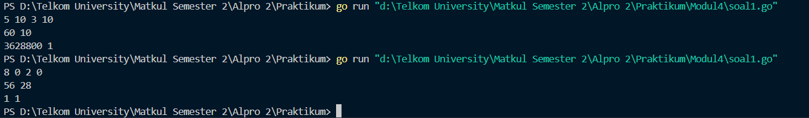
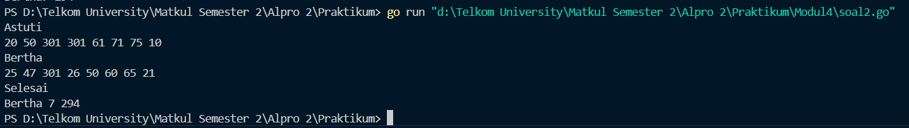
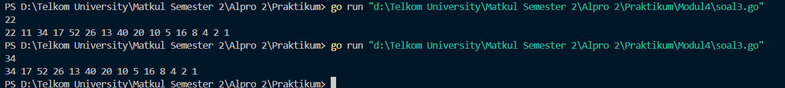

<h1 align="center">Laporan Praktikum Modul 4  
<br>Prosedur</h1>


<p align="center"> Faiz Az-Zahra Winanto Putra - 103112430001 </p>

### Dasar Teori 

Prosedur dapat dianggap sebagai potongan beberapa instruksi program menjadi suatu instruksi baru yang dibuat untuk mengurangi kerumitan dari kode program yang kompleks pada suatu program yang besar. Prosedur akan menghasilkan suatu akibat atau efek langsung pada program ketika dipanggil pada program utama. Suatu subprogram dikatakan prosedur apabila: 

1. Tidak ada deklarasi tipe nilai yang dikembalikan, dan 
2. Tidak terdapat kata kunci return dalam badan subprogram.

### Unguided

#### Soal Latihan Modul 4

##### Soal 1
>Minggu ini, mahasiswa Fakultas Informatika mendapatkan tugas dari mata kuliah matematika diskrit untuk mempelajari kombinasi dan permutasi. Jonas salah seorang mahasiswa, iseng untuk mengimplementasikannya ke dalam suatu program. Oleh karena itu bersediakah kalian membantu Jonas? (tidak tentunya ya :p) 
>
>Masukan terdiri dari empat buah bilangan asli 𝑎, 𝑏, 𝑐, dan 𝑑 yang dipisahkan oleh spasi, dengan syarat 𝑎 ≥ 𝑐 dan 𝑏 ≥ 𝑑. 
>
>Keluaran terdiri dari dua baris. Baris pertama adalah hasil permutasi dan kombinasi 𝒂 terhadap 𝑐, sedangkan baris kedua adalah hasil permutasi dan kombinasi 𝑏 terhadap 𝑑. Catatan: permutasi (P) dan kombinasi (C) dari 𝑛 terhadap 𝑟 (𝑛 ≥ 𝑟) dapat dihitung dengan menggunakan persamaan berikut! 
>

Dengan Rumus
```
P(𝑛,𝑟) = 𝑛!/(𝑛−𝑟)! , sedangkan 𝐶(𝑛,𝑟) = 𝑛!/𝑟!(𝑛−𝑟)!
```


```go
package main

  

import ("fmt")

func factorial(n int, hasil *int) {
    *hasil = 1
    for i := 2; i <= n; i++ {
        *hasil *= i
    }
} 
  

func permutation(n, r int, hasil *int) {
    *hasil = 0
    if n >= r {
        var factN, factNR int
        factorial(n, &factN)
        factorial(n-r, &factNR)
        *hasil = factN / factNR
    }
}


func combination(n, r int, hasil *int) {
    *hasil = 0
    if n >= r {
        var factN, factR, factNR int
        factorial(n, &factN)
        factorial(r, &factR)
        factorial(n-r, &factNR)
        *hasil = factN / (factR * factNR)
    }
}


func main() {
    var a, b, c, d int
    fmt.Scan(&a, &b, &c, &d)
  
    if a < c || b < d {
        fmt.Println("Masukan tidak valid, pastikan a >= c dan b >= d")
    } else {

        var p1, c1, p2, c2 int
        permutation(a, c, &p1)
        combination(a, c, &c1)
        permutation(b, d, &p2)
        combination(b, d, &c2)

        fmt.Println(p1, c1)
        fmt.Println(p2, c2)
    }
}
```




Program ini menghitung permutasi dan kombinasi berdasarkan empat bilangan inputan. Langkah Pertama, program meminta pengguna memasukkan nilai dari `a, b, c, d`, lalu memeriksa validitasnya. Jika valid, program menghitung permutasi dan kombinasi menggunakan fungsi`permutasi()` dan `kombinasi()`, yang didasarkan pada fungsi `faktorial()`. 

##### Prosedur Factorial
```go
func factorial(n int, hasil *int) {
    *hasil = 1
    for i := 2; i <= n; i++ {
        *hasil *= i
    }
  }
```

Prosedur faktorial untuk menghitung faktorial dari suatu bilangan n dengan menginisialisasi hasil ke 1, lalu mengalikannya dengan setiap bilangan dari 2 hingga n. Hasilnya disimpan langsung ke pointer hasil, agar perubahan nilai tanpa perlu return. 

##### Prosedur Permutation
```go
func permutation(n, r int, hasil *int) {
    *hasil = 0
    if n >= r {
        var factN, factNR int
        factorial(n, &factN)
        factorial(n-r, &factNR)
        *hasil = factN / factNR
    }
}
```

**Prosedur permutation** digunakan untuk menghitung permutasi berdasarkan rumus P(n,r)=n! / (n−r)!. Prosedur ini pertama-tama memanggil factorial() untuk menghitung n! dan (n-r)!, lalu hasil permutasi diperoleh dengan membagi n! dengan (n-r)!.
##### Prosedur Combination
```go
func combination(n, r int, hasil *int) {
    *hasil = 0
    if n >= r {
        var factN, factR, factNR int
        factorial(n, &factN)
        factorial(r, &factR)
        factorial(n-r, &factNR)
        *hasil = factN / (factR * factNR)
    }
 }
```

Prosedur untuk menghitung nilai kombinasi menggunakan rumus C(n,r)=n!/r!(n−r)!
Yang pertama program lakukan  nilai hasil diinisialisasi dengan 0 untuk melakukan kasus ketika `n < r`. Jika `n >= r`, prosedur menghitung faktorial dari `n`, `r`, dan `n-r` menggunakan prosedur `faktorial()`.

Jadi, program ini membaca input, memverifikasi syaratnya, menghitung permutasi dan kombinasi dengan prosedur, lalu mencetak hasilnya dalam dua baris.
##### Soal 2
>Kompetisi pemrograman tingkat nasional berlangsung ketat. Setiap peserta diberikan 8 soal yang harus dapat diselesaikan dalam waktu 5 jam saja. Peserta yang berhasil menyelesaikan soal paling banyak dalam waktu paling singkat adalah pemenangnya. Buat program gema yang mencari pemenang dari daftar peserta yang diberikan. Program harus dibuat modular, yaitu dengan membuat prosedur hitungSkor yang mengembalikan total soal dan total skor yang dikerjakan oleh seorang peserta, melalui parameter formal. Pembacaan nama peserta dilakukan di program utama, sedangkan waktu pengerjaan dibaca di dalam prosedur. 
>

```
prosedure hitungSkor(in/out soal, skor : integer)
```


>Setiap baris masukan dimulai dengan satu string nama peserta tersebut diikuti dengan adalah 8 integer yang menyatakan berapa lama (dalam menit) peserta tersebut menyelesaikan soal. Jika tidak berhasil atau tidak mengirimkan jawaban maka otomatis dianggap menyelesaikan dalam waktu 5 jam 1 menit (301 menit). 
>
>Satu baris keluaran berisi nama pemenang, jumlah soal yang diselesaikan, dan nilai yang diperoleh. Nilai adalah total waktu yang dibutuhkan untuk menyelesaikan soal yang berhasil diselesaikan.


```go
package main
  

import (
    "fmt"
    "math"
)  

func hitungSkor(jumlahSoal *int, totalSkor *int) {
    *jumlahSoal = 0
    *totalSkor = 0

    var waktuPengerjaan int

    for i := 0; i < 8; i++ {
        fmt.Scan(&waktuPengerjaan)
        if waktuPengerjaan <= 300 {
            *jumlahSoal++
            *totalSkor += waktuPengerjaan
        }
    }
}

func main() {
    var peserta, juara string
    var jumlahSoal, totalSkor int
    maxJumlahSoal := -1
    minTotalSkor := math.MaxInt32
  
    for {
        fmt.Scan(&peserta)
        if peserta == "Selesai" {
            break
        }

        hitungSkor(&jumlahSoal, &totalSkor)

        if jumlahSoal > maxJumlahSoal || (jumlahSoal == maxJumlahSoal && totalSkor < minTotalSkor) {
            maxJumlahSoal = jumlahSoal
            minTotalSkor = totalSkor
            juara = peserta
        }
    }


    fmt.Println(juara,  maxJumlahSoal,  minTotalSkor)

```


Program ini untul menentukan pemenang kompetisi berdasarkan jumlah soal yang diselesaikan dan total waktu pengerjaan. Setiap peserta memasukkan namanya, lalu memberikan delapan waktu pengerjaan soal. Jika waktu ≤ 300 detik, soal dihitung sebagai berhasil. Program akan membandingkan hasil peserta dengan pemenang sementara, memilih yang menyelesaikan soal terbanyak atau, jika sama, yang memiliki total waktu terkecil. Proses berulang hingga penggu menginputkan "Selesai", lalu program akan menampilkan nama pemenang beserta hasilnya.

##### Prosedur yang digunakan :

###### Prosedur hitungSkor
```go
func hitungSkor(jumlahSoal *int, totalSkor *int) {
    *jumlahSoal = 0
    *totalSkor = 0

    var waktuPengerjaan int

    for i := 0; i < 8; i++ {
        fmt.Scan(&waktuPengerjaan)
        if waktuPengerjaan <= 300 {
            *jumlahSoal++
            *totalSkor += waktuPengerjaan
        }
    }
}
```

Prosedur hitungSkor berfungsi untuk menentukan jumlah soal yang berhasil diselesaikan serta menghitung total waktu yang digunakan oleh seorang peserta. Prosedur ini menerima dua parameter, yaitu soal dan skor, yang dikirimkan sebagai referensi agar hasil perhitungannya dapat dikembalikan ke fungsi pemanggil. Pada awal eksekusi, kedua variabel tersebut diatur ke nol. Program kemudian membaca delapan input yang merepresentasikan waktu penyelesaian masing-masing soal. Jika waktu yang diberikan kurang dari 301 menit, maka soal dianggap selesai, dan waktunya ditambahkan ke dalam total skor.

##### Soal 3
>Skiena dan Revilla dalam Programming Challenges mendefinisikan sebuah deret bilangan. Deret dimulai dengan sebuah bilangan bulat n. Jika bilangan n saat itu genap, maka suku berikutnya adalah ½n, tetapi jika ganjil maka suku berikutnya bernilai 3n+1. Rumus yang sama digunakan terus menerus untuk mencari suku berikutnya. Deret berakhir ketika suku terakhir bernilai 1. Sebagai contoh jika dimulai dengan n=22, maka deret bilangan yang diperoleh adalah:

```
                    22 11 34 17 52 26 13 40 20 10 5 16 8 4 2 1
```

Untuk suku awal sampai dengan 1000000, diketahui deret selalu mencapai suku dengan nilai 1. Buat program skiena yang akan mencetak setiap suku dari deret yang dijelaskan di atas untuk nilai suku awal yang diberikan. Pencetakan deret harus dibuat dalam prosedur cetakDeret yang mempunyai 1 parameter formal, yaitu nilai dari suku awal. 
```
prosedure cetakDeret(in n : integer )
``` 
###### Masukan :
berupa satu bilangan integer positif yang lebih kecil dari 1000000. 
###### Keluaran :
terdiri dari satu baris saja. Setiap suku dari deret tersebut dicetak dalam baris yang dan dipisahkan oleh sebuah spasi.

```go
package main 

import (
    "fmt"
)

func cetakDeret(n int) {
    for n != 1 {
        fmt.Print(n, " ")
        if n%2 == 0 {
            n = n / 2
        } else {
            n = 3*n + 1
        }
    }
    fmt.Println(n)
}

  
func main() {
    var n int
    fmt.Scan(&n)

    if n > 0 && n < 1000000 {
        cetakDeret(n)
    } else {
        fmt.Println("Input tidak valid.")
    }
}
```



Program ini mencetak deret bilangan berdasarkan aturan Skiena dan Revilla dalam bahasa Go. Prosedur cetakDeret menghasilkan deret dengan aturan: jika `n` genap, dibagi dua; jika n ganjil, dihitung `3n + 1`, hingga mencapai 1. 

Program ini menerima input bilangan positif kurang dari 1.000.000, lalu mencetak deretnya. Jika input tidak valid, program menampilkan pesan kesalahan.

##### Prosedur yang digunakan :

###### Prosedur cetakDeret

```go
func cetakDeret(n int) {
    for n != 1 {
        fmt.Print(n, " ")
        if n%2 == 0 {
            n = n / 2
        } else {
            n = 3*n + 1
        }
    }
    fmt.Println(n)
}
```

Prosedur cetakDeret untuk mencetak deret bilangan Skiena berdasarkan aturan:

- Jika n adalah **genap**, maka suku berikutnya adalah n / 2.
- Jika n adalah **ganjil**, maka suku berikutnya adalah 3n + 1.
- Deret **berhenti** saat nilai n mencapai **1**.

Proses ini terus berlanjut hingga n bernilai **1**, yang kemudian dicetak sebagai angka terakhir dalam deret.
