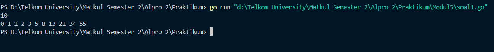
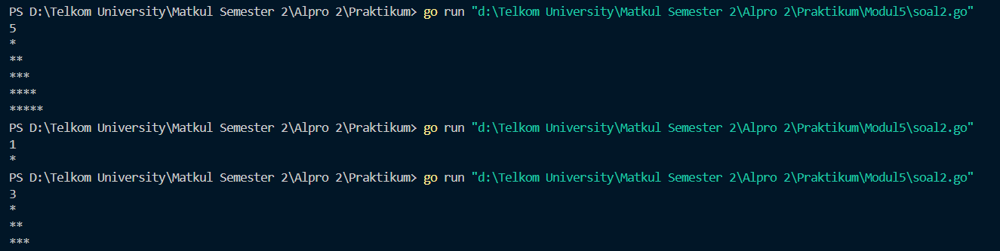
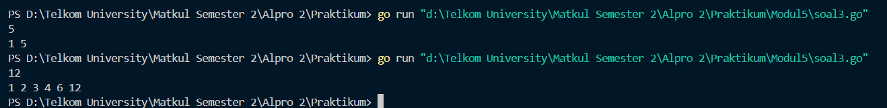
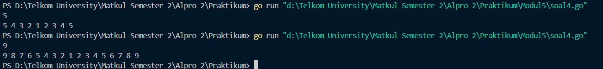
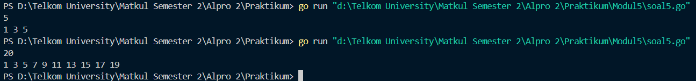
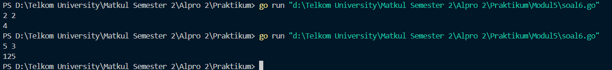

<h1 align="center">Laporan Praktikum Modul 5  
<br>Rekursif</h1>


<p align="center"> Faiz Az-Zahra Winanto Putra - 103112430001 </p>

### Dasar Teori 

Rekursif adalah sebuah teknik di pemrograman, di mana sebuah fungsi memanggil dirinya sendiri. Mirip dengan loop (perulangan), yang kedua tujuannya memanggil aksi yang sama berkali-kali.

Namun rekursi sering digunakan untuk menyelesaikan masalah yang lebih kompleks:

- Yang tidak bisa (sulit) diselesaikan dengan loop biasa
- Atau kode implementasinya akan sangat sulit dibaca jika menggunakan loop (iterasi)

### Unguided

#### Soal Latihan Modul 5

##### Soal 1
>Deret fibonacci adalah sebuah deret dengan nilai suku ke-0 dan ke-1 adalah 0 dan 1, dan nilai suku ke-n selanjutnya adalah hasil penjumlahan dua suku sebelumnya. Secara umum dapat diformulasikan 𝑆𝑛 = 𝑆𝑛−1 + 𝑆𝑛−2 . Berikut ini adalah contoh nilai deret fibonacci hingga suku ke-10. Buatlah program yang mengimplementasikan fungsi rekursif pada deret fibonacci tersebut.


```go
package main

import "fmt"

func fibonacci(n int) int {
    if n == 0 {
        return 0
    } else if n == 1 {
        return 1
    }
    return fibonacci(n-1) + fibonacci(n-2)
}


func main() {
    var n int

    fmt.Scan(&n)
  
    for i := 0; i <= n; i++ {
        fmt.Print(fibonacci(i), " ")
    }
    fmt.Println()
}
```




Program di atas berfungsi untuk mencetak deret Fibonacci hingga angka ke- _n_ yang dimasukkan oleh pengguna. Program dimulai dengan mendefinisikan fungsi rekursif `fibonacci(n int) int`, yang menghitung nilai Fibonacci ke-_n_ berdasarkan rumus dasar: jika _n_ adalah 0, maka hasilnya 0; jika _n_ adalah 1, maka hasilnya 1; jika _n_ lebih besar dari 1, maka hasilnya adalah penjumlahan dari dua nilai Fibonacci sebelumnya, yaitu `fibonacci(n-1) + fibonacci(n-2)`.

#### **Base Case**

```go
if n == 0 {
    return 0
} else if n == 1 {
    return 1
}

```

- Jika n == 0, fungsi mengembalikan **0**.
- Jika n == 1, fungsi mengembalikan **1**.
#### **Recursive case**

```go
return fibonacci(n-1) + fibonacci(n-2)
```

Untuk n >= 2, fungsi memanggil dirinya sendiri dan prosesnya akan berjalan terus hingga mencapai **base case** yang menjadi kondisi berhenti.

##### Soal 2
>Buatlah sebuah program yang digunakan untuk menampilkan pola bintang berikut ini dengan menggunakan fungsi rekursif. N adalah masukan dari user.

```go
package main

import (
    "fmt"
) 
  
func cetakBintang(n int) {
    if n > 0 {
        fmt.Print("*")
        cetakBintang(n - 1)
    }
}

  
func cetakPola(bilangan, max int) {
    if bilangan <= max {
        cetakBintang(bilangan)
        fmt.Println()
        cetakPola(bilangan+1, max)
    }
}

func main() {
    var n int
    fmt.Scan(&n)
    cetakPola(1, n)
}
```


Program ini berfungsi untuk mencetak pola segitiga bintang. Program menggunakan **rekursif** untuk mencetak bintang dalam pola bertingkat, di mana setiap baris memiliki jumlah bintang yang bertambah secara bertahap dari 1 hingga _n_.

#### **Base Case**

##### Base Case pada cetakBintang:

```go
if n > 0 {
    fmt.Print("*")
    cetakBintang(n - 1)
}

```

Rekursif berhenti ketika `n <= 0`, sehingga tidak ada lagi pemanggilan `cetakBintang(n-1)`.

##### Base Case pada cetakPola:

```go
if bilangan <= max {
    cetakBintang(bilangan)
    fmt.Println()
    cetakPola(bilangan+1, max)
}
```

Rekursi berhenti ketika `current > max`, sehingga tidak ada lagi pemanggilan `cetakPola(bilangan+1, max)`.
#### **Recursive case**

##### Recursive Case pada cetakBintang:

```go
fmt.Print("*")
cetakBintang(n - 1)
```

Sebuah fungsi akan terus memanggil dirinya sendiri dengan `n-1`, mencetak satu bintang setiap kali dipanggil.
##### Recursive Case pada cetakPola:

```go
cetakBintang(bilangan)
fmt.Println()
cetakPola(bilangan+1, max)
```

Sebuah fungsi mencetak bintang sebanyak `bilangan`, lalu memanggil dirinya sendiri dengan `current+1` hingga mencapai `max`. / maksimal
##### Soal 3
>Buatlah program yang mengimplementasikan rekursif untuk menampilkan faktor bilangan dari suatu N, atau bilangan yang apa saja yang habis membagi N. 

>Masukan terdiri dari sebuah bilangan bulat positif N. 

>Keluaran terdiri dari barisan bilangan yang menjadi faktor dari N (terurut dari 1 hingga N ya).

```go
package main 

import (
    "fmt"
)
  
func faktor(n, bilangan int) {
    if bilangan > n {
        return
    }
    if n%bilangan == 0 {
        fmt.Print(bilangan, " ")
    }
    faktor(n, bilangan+1)
}
  
func main() {
    var n int
    fmt.Scan(&n)
    faktor(n, 1)
    fmt.Println()
}
```



Program ini berfungsi untuk mencetak semua faktor dari suatu bilangan _n_ menggunakan rekursif. Faktor dari sebuah bilangan adalah angka yang dapat membagi bilangan tersebut tanpa sisa.

#### **Base Case**

```go
if bilangan > n {
    return
}
```

Jika bilangan melebihi n, maka fungsi berhenti (return), artinya semua faktor sudah dicek.

#### **Recursive case**

```go
if n%bilangan == 0 {
        fmt.Print(bilangan, " ")
    }
    faktorBilangan(n, bilangan+1)
   }
```

Jika n **habis dibagi** oleh variabel bilangan (n % bilangan == 0), maka angka tersebut dicetak. Setelah itu, fungsi memanggil dirinya sendiri dengan **bilangan + 1** untuk mengecek angka berikutnya.
##### Soal 4
>Buatlah program yang mengimplementasikan rekursif untuk menampilkan barisan bilangan tertentu. 

>Masukan terdiri dari sebuah bilangan bulat positif N. 

>Keluaran terdiri dari barisan bilangan dari N hingga 1 dan kembali ke N.
```go
package main

import "fmt"
  
func barisanBilangan(n, bilangan int) {
    if bilangan < 1 {
        return
    }
    fmt.Print(bilangan, " ")  
    barisanBilangan(n, bilangan-1)
    if bilangan < n {
        fmt.Print(bilangan+1, " ")
    }
}
  
func main() {
    var n int
    fmt.Scan(&n)
    barisanBilangan(n, n)
}

```



Program ini digunakan untuk **menampilkan barisan bilangan** dari N hingga `1`, lalu kembali lagi ke N, menggunakan **rekursi**.

#### **Base Case**

```go
if bilangan < 1 {
    return
}
```

Ketika `bilangan` sudah lebih kecil dari 1, fungsi berhenti memanggil dirinya sendiri.

#### **Recursive case**

```go
barisanBilangan(n, bilangan-1)
    if bilangan < n {
        fmt.Print(bilangan+1, " ")
    }
```

Recursive case terdiri dari dua bagian:
1. Panggilan rekursif ke barisanBilangan(n, bilangan-1) untuk mencetak angka menurun.
2. Cetakan tambahan fmt.Print(bilangan+1, " ") untuk mencetak angka naik setelah rekursi kembali.

##### Soal 5
>Buatlah program yang mengimplementasikan rekursif untuk menampilkan barisan bilangan ganjil. 

>Masukan terdiri dari sebuah bilangan bulat positif N. 

>Keluaran terdiri dari barisan bilangan ganjil dari 1 hingga N

```go
package main

import "fmt"


func cetakGanjil(i, n int) {
    if i <= n {
        fmt.Print(i, " ")
        cetakGanjil(i+2, n)
    }
}
 
func main() {
    var n int
    fmt.Scan(&n)
    cetakGanjil(1, n)
}
```



Ketika program berjalan, program akan meminta inputan berupa nilai n, yang kemudian nilai n akan di eksekusi oleh prosedur bilanganGanjil, yang dimana kita menentukan nilai awal adalah 1. nilai 1 akan masuk ke dalam variabel i, yang kemudian akan dicek apakah nilai dari i <= n. Jika true, maka program akan mencetak i dan i ditambah dengan 2. Ketika nilai i sudah sama atau lebih besar dari nilai n, maka program akan berhenti.

#### **Base Case**

```go
if i <= n {
        fmt.Print(i, " ")
}
```

Ketika `i > n`, fungsi tidak lagi memanggil dirinya sendiri, sehingga rekursif berhenti.

#### **Recursive case**

```go
cetakGanjil(i+2, n)
```

Setiap rekursif, `i` bertambah **2**, sehingga hanya bilangan ganjil yang tercetak.

##### Soal 6
>Buatlah program yang mengimplementasikan rekursif untuk mencari hasil pangkat dari dua buah bilangan. 
>
>Masukan terdiri dari bilangan bulat x dan y. 

>Keluaran terdiri dari hasil x dipangkatkan y. 

>Catatan: diperbolehkan menggunakan asterik "*", tapi dilarang menggunakan import "math".

```go
package main 

import (
    "fmt"
)


func pangkat(x, y int) int {
    if y == 0 {
        return 1
    }
    return x * pangkat(x, y-1)
}


func main() {
    var x, y int
    fmt.Scan(&x)
    fmt.Scan(&y)

    result := pangkat(x, y)
    fmt.Println(result)
}
```


Program ini digunakan untuk **menghitung hasil pangkat** dari dua bilangan bulat x dan y menggunakan **rekursi**. Program menerima dua bilangan x (basis) dan y (eksponen), lalu mengembalikan hasil dari x^y tanpa menggunakan **package math**.
#### **Base Case**

```go
if y == 0 {
    return 1
}
```

Ketika _y_ sudah berada di **0**, hasilnya langsung **1**, sehingga rekursi berhenti.

#### **Recursive case**

```go
return x * pangkat(x, y-1)
```

Setiap rekursi, nilai _y_ berkurang **1** hingga mencapai base case.


